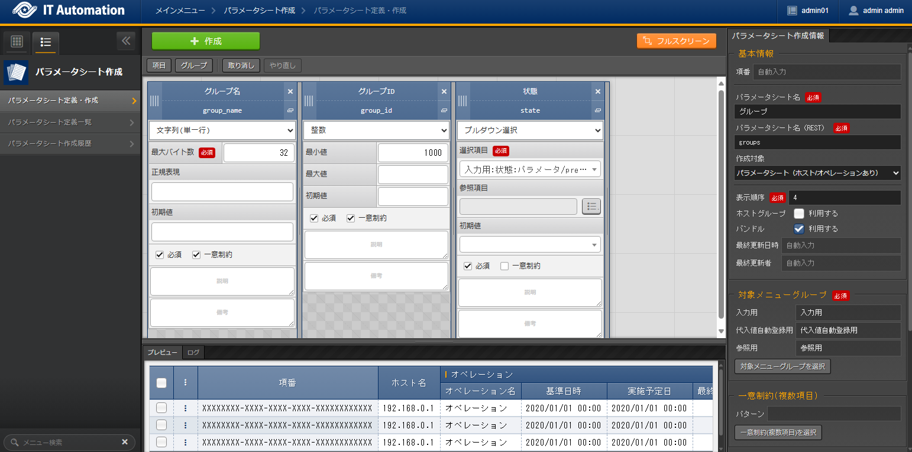
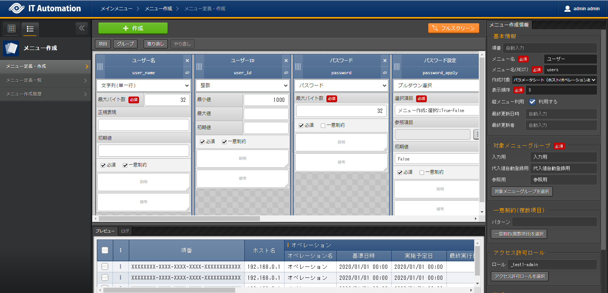
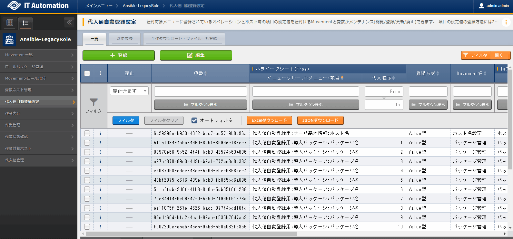
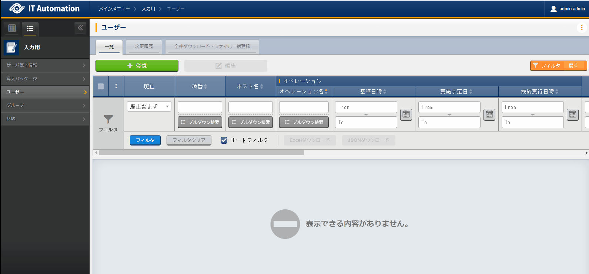

===================
User management (Answer)
===================

Problem (Repost)
===========

| Users can use Exastro IT Automation to manage data as seen below.
| When doing so, user will have to configure hosts and manage Packages in addition to manage users.

.. list-table:: User information
  :widths: 10 10 10 10
  :header-rows: 1

  * - Username
    - User ID
    - Login password
    - Group name
  * - wwwuser01
    - 10001
    - password01
    - www
  * - wwwuser02
    - 10002
    - password02
    - www
  * - appuser01
    - 20001
    - password01
    - app
  * - appuser02
    - 20002
    - password02
    - app

Create execution overview
==============

| First, plan the execution.

.. list-table:: Execution plan
   :widths: 15 10
   :header-rows: 0

   * - Execution date
     - 2023/04/04 12:00:00
   * - Execution target
     - web01(RHEL8)
   * - Execution contents
     - Add user to Web server

Register execution overview
------------

| From :menuselection:`Basic console --> Operation list`, register execution date and execution name.

.. figure:: ../../../../images/learn/quickstart/answer1/作業概要登録.png
   :width: 1200px
   :alt: Conductor Execution

.. list-table:: Operation registration contents
   :widths: 15 10
   :header-rows: 1

   * - Operation name
     - Reserved execution date
   * - :kbd:`Add user to Web server`
     - :kbd:`2023/04/04 12:00:00`

Design Parameters
==============

| In this guide, the user will learn how to manage users. In order to do so, the users must belong to a group.
| Start with making the user be able to manage parameter sheets.

.. _groups_parameter_sheet:

Create Parameter sheet for groups
------------------------------

| Create a parameter sheet for the group.
| The Ansible Role package used is `Group settings <https://github.com/exastro-playbook-collection/OS-RHEL8/tree/master/RH_group/OS_build>`_. So make a parameter sheet that can manage the following parameters

.. list-table:: Group setting parameters
   :widths: 10 15
   :header-rows: 1

   * - Item
     - Description
   * - group_name
     - Group name
   * - group_id
     -	Group ID
   * - action
     - | Constructing settings
       | present: Create/Edit
       | absent: Delete

| From :menuselection:`Create Parameter sheets --> Define/Create Parameter sheets` register Parameter sheet.

.. tip:: 
   | Bu ticking both :kbd:`Required` :kbd:`Unique constraint` user can reference items from external parameter sheets.

.. tip:: 
   | By ticking the  "Use" checkbox for :menuselection:`Using bundle`, users can configure multiple parameters to single setting items.

.. figure:: ../../../../images/learn/quickstart/answer1/グループのパラメータシート作成.gif
   :width: 1200px
   :alt: Creating Group parameter sheet

.. list-table:: Group parameter sheet setting value
   :widths: 10 10 10 10
   :header-rows: 1
   :class: filter-table

   * - Setting item
     - Item 1 setting value
     - Item 2 setting value
     - Item 3 setting value
   * - Item name
     - :kbd:`Group name`
     - :kbd:`Group ID`
     - :kbd:`State`
   * - Item name(Rest API) 
     - :kbd:`group_name`
     - :kbd:`group_id`
     - :kbd:`state`
   * - Input method
     - :kbd:`String (single line)`
     - :kbd:`Integer`
     - :kbd:`Pulldown selection`
   * - Minimum value
     - (No item)
     - 1000
     - (No item)
   * - Maximum value
     - (No item)
     - 
     - (No item)
   * - Maximum bytes
     - :kbd:`32`
     - (No item)
     - (No item)
   * - Regular expression
     - 
     - (No item)
     - (No item)
   * - Select item
     - (No item)
     - (No item)
     - :kbd:`Input:State:present-absent`
   * - Reference item
     - (No item)
     - (No item)
     - 
   * - Default value
     - 
     - 
     - 
   * - Required
     - ✓
     - ✓
     - ✓
   * - Unique constraint
     - ✓
     - ✓
     - 
   * - Description
     - 
     - 
     - 
   * - Remarks
     - 
     - 
     - 

.. list-table:: Parameter sheet creation information and setting value
   :widths: 5 10
   :header-rows: 1
   :class: filter-table

   * - Item name
     - Setting value
   * - Item number
     - (Automatic)
   * - Menu name
     - :kbd:`Group`
   * - Menu name(REST)
     - :kbd:`groups`
   * - Creation target
     - :kbd:`Parameter sheet(with host/operation)`
   * - Display order
     - :kbd:`4`
   * - Using bundles
     - Check "Use"(Active)
   * - Last updated date
     - (Automatic)
   * - Last updated by
     - (Automatic)

Create Parameter sheet for user
------------------------------

| Create a parameter sheet for the user.
| The Ansible Role package used is `User settings <https://github.com/exastro-playbook-collection/OS-RHEL8/tree/master/RH_user/OS_build>`_ So make a parameter sheet that can manage the following parameters

.. list-table:: User setting parameters
   :widths: 10 15
   :header-rows: 1

   * - Item
     - Description
   * - user_name
     - Username
   * - user_id
     -	User ID
   * - group_id
     -	Group ID
   * - comment
     -	Comment
   * - home_dir
     - Home directory
   * - login_shell
     - Login shell name
   * - password
     -	Password
   * - action
     - | Constructing settings
       | present: Create/Edit
       | absent: Delete
   * - password_apply
     - | Decides whether to configure Password or not when constructing
       | true: Configures password
       | false: Does not configure password

.. warning:: 
   | `exastro-playbook-collection <https://github.com/exastro-playbook-collection>`_ is provided together with the ITA readme file, meaning that the user will have to manage all the parameters for the variables specified in ITA readme.

| From :menuselection:`Create Parameter sheets --> Define/Create Parameter sheets` register a Parameter sheet.

.. tip:: 
   | By configuring :menuselection:`Input method` to :kbd:`Pulldown selection` , userse can refer data sheets egistered in :ref:`groups_parameter_sheet`.

.. figure:: ../../../../images/learn/quickstart/answer1/ユーザーのパラメータシート作成_1.gif
   :width: 1200px
   :alt: Creating User parameter sheet 1

.. list-table:: Parameter item setting value(1/2)
   :widths: 10 10 10 10 10 10
   :header-rows: 1
   :class: filter-table

   * - Setting item
     - Item1 setting value
     - Item2 setting value
     - Item3 setting value
     - Item4 setting value
     - Item5 setting value
   * - Item name
     - :kbd:`Username`
     - :kbd:`User ID`
     - :kbd:`Password`
     - :kbd:`Password settings`
     - :kbd:`Group`
   * - Item name(Rest API) 
     - :kbd:`user_name`
     - :kbd:`user_id`
     - :kbd:`password`
     - :kbd:`password_apply`
     - :kbd:`group`
   * - Input method
     - :kbd:`String (single line)`
     - :kbd:`Integer`
     - :kbd:`Password`
     - :kbd:`Pulldown selection`
     - :kbd:`Pulldown selection`
   * - Maximum bytes
     - :kbd:`32`
     - (No item)
     - :kbd:`32`
     - (No item)
     - (No item)
   * - Regular expression
     - 
     - (No item)
     - (No item)
     - (No item)
     - (No item)
   * - Minimum value
     - (No item)
     - :kbd:`1000`
     - (No item)
     - (No item)
     - (No item)
   * - Maximum value
     - (No item)
     - 
     - (No item)
     - (No item)
     - (No item)
   * - Select item
     - (No item)
     - (No item)
     - (No item)
     - :kbd:`Create Parameter sheets:Select 2:True-False`
     - :kbd:`Input:Group:Group name`
   * - Reference item
     - (No item)
     - (No item)
     - (No item)
     - 
     - 
   * - Default value
     - 
     - 
     - (No item)
     - :kbd:`False`
     - 
   * - Required
     - ✓
     - ✓
     - ✓
     - ✓
     - ✓
   * - Unique constraint
     - ✓
     - ✓
     - 
     - 
     - 
   * - Description
     - 
     - 
     - 
     - 
     - 
   * - Remarks
     - 
     - 
     - 
     - 
     - 

.. figure:: ../../../../images/learn/quickstart/answer1/ユーザーのパラメータシート作成_2.gif
   :width: 1200px
   :alt: Create User parameter sheet 2

.. list-table:: Parameter item setting value(2/2)
   :widths: 10 10 10 10 10
   :header-rows: 1
   :class: filter-table

   * - Setting item
     - Item6 setting value
     - Item7 setting value
     - Item8 setting value
     - Item9 setting value
   * - Item name
     - :kbd:`Home directory`
     - :kbd:`Login shell`
     - :kbd:`Comment`
     - :kbd:`State`
   * - Item name(Rest API) 
     - :kbd:`home_dir`
     - :kbd:`login_shell`
     - :kbd:`comment`
     - :kbd:`state`
   * - Input method
     - :kbd:`String (single line)`
     - :kbd:`String (single line)`
     - :kbd:`String (single line)`
     - :kbd:`Pulldown selection`
   * - Maximum bytes
     - :kbd:`128`
     - :kbd:`32`
     - :kbd:`128`
     - (No item)
   * - Regular expression
     - 
     - 
     - 
     - (No item)
   * - Minimum value
     - (No item)
     - (No item)
     - (No item)
     - (No item)
   * - Maximum value
     - (No item)
     - (No item)
     - (No item)
     - (No item)
   * - Select item
     - (No item)
     - (No item)
     - (No item)
     - :kbd:`Input:State:present-absent`
   * - Reference item
     - (No item)
     - (No item)
     - (No item)
     - 
   * - Default value
     - 
     - :kbd:`/bin/bash`
     - 
     - 
   * - Required
     - ✓
     - ✓
     - ✓
     - ✓
   * - Unique constraint
     - 
     - 
     - 
     - 
   * - Description
     - 
     - 
     - 
     - 
   * - Remarks
     - 
     - 
     - 
     - 

.. list-table:: Parameter sheet creation information setting value
   :widths: 5 10
   :header-rows: 1
   :class: filter-table

   * - Item name
     - Setting value
   * - Item number
     - (Automatic)
   * - Menu name
     - :kbd:`User`
   * - Menu name(REST)
     - :kbd:`users`
   * - Creation target
     - :kbd:`Parameter sheet(with host/operation)`
   * - Display order
     - :kbd:`3`
   * - Using bundles
     - Check "Use"(Active)
   * - Last updated date
     - (Automatic)
   * - Last updated by
     - (Automatic)

Register excution target
==============

| Register the device that will be the execution target.

Register device
--------

| The target server is the one created in the :doc:`previous scenario <scenario1>`, meaning that the user does not have to create a new one.

Register work procedure
==============

| Configure the Movement so the Ansible role creates/deletes group and then creates/deletes user in order.
| In the scenarios up until now, we have linked 1 Ansible role to single Movements. In this scenario, we will configure so both users and groups are managed in a single movement.

.. note:: 
   | The user can also create a Movement for each of the tasks to see the same result.

Register Movement
-------------

| From :menuselection:`Ansible-LegacyRole --> Movement list`, register Movement for the Host name settings.

.. figure:: ../../../../images/learn/quickstart/answer1/Movement登録.png
   :width: 1200px
   :alt: Register Movement
   
.. list-table:: Movement information setting value
   :widths: 10 10
   :header-rows: 2

   * - Movement name
     - Ansible use information
   * - 
     - Host specification format
   * - :kbd:`User management`
     - :kbd:`IP`

Register Ansible Role
-----------------

| The Role package used  is the `Exastro Playbook Collection <https://github.com/exastro-suite/playbook-collection-docs/blob/master/ansible_role_packages/README.md>`_  from the :doc:`Previous scenario <scenario1>`.

Link Movement and Ansible Role
---------------------------------

| From the :menuselection:`Ansible-LegacyRole --> Movement-role link` menu, link the Movement and the Ansible Role packages.
| In this scenario, `Ansible Role Package for Group management <https://github.com/exastro-playbook-collection/OS-RHEL8/tree/master/RH_group/OS_build>`_ and `Ansible Role package for Group management<https://github.com/exastro-playbook-collection/OS-RHEL8/tree/master/RH_user/OS_build>`_  is used.
| When creating Users, the user must first specify a group. Make sure to configure include orders in the following order.

.. figure:: ../../../../images/learn/quickstart/answer1/MovementとAnsibleRoleの紐づけ.png
   :width: 1200px
   :alt: Link Movement AnsibleRole

.. list-table:: Register Movement-Role link information
  :widths: 10 30 10
  :header-rows: 1

  * - Movement name
    - Role package name:Role name
    - Include order
  * - :kbd:`User management`
    - :kbd:`OS-RHEL8:OS-RHEL8/RH_group/OS_build`
    - :kbd:`1`
  * - :kbd:`User management`
    - :kbd:`OS-RHEL8:OS-RHEL8/RH_user/OS_build`
    - :kbd:`2`

Variable nest management
--------------

| The group and user variables are the following multistage variables.

.. code-block:: yaml
   :caption: VAR_RH_group variable structure(=Multistage variable)

   # The variable sets loops to VAR_RH_group with no set number.
   VAR_RH_group:
   - action: present
     group_id: '1100'
     group_name: testgroup
   - action: present
     group_id: '1101'
     group_name: testgroup2
   - action: absent
     group_name: testgroup3
     ...

.. code-block:: yaml
   :caption: VAR_RH_user variable structure(=Multistage variable)

   # The variable sets loops to VAR_RH_user with no set number.
   VAR_RH_user:
   - action: present
     comment: create testuser
     group_id: '1100'
     home_dir: /home/testuser
     login_shell: /bin/bash
     password: p@ssw0rd123
     password_apply: true
     user_id: '1100'
     user_name: testuser
   - action: present
     comment: update testuser2
     group_id: '1101'
     home_dir: /home/testuser2
     login_shell: /bin/bash
     password_apply: false
     user_id: '1102'
     user_name: testuser2
   - action: absent
     user_name: testuser99
     ...

| Multistage variables must have their maximum limit set on beforehand.

.. figure:: ../../../../images/learn/quickstart/answer1/変数ネスト管理.gif
   :width: 1200px
   :alt: Variable nest management

.. list-table:: Reginstering Variable nest information
   :widths: 10 10 20 10
   :header-rows: 1

   * - Movement name
     - Variable name
     - Member variable name(With repetitions)
     - Maximum repetitions
   * - :kbd:`User management`
     - :kbd:`VAR_RH_group`
     - :kbd:`0`
     - :kbd:`5`
   * - :kbd:`User management`
     - :kbd:`VAR_RH_user`
     - :kbd:`0`
     - :kbd:`10`

Substitute value auto registration settings
------------------

| From the :menuselection:`Ansible-LegacyRole --> Substitute value auto registration settings` link the Ansible role package variables with the Parameter items.
| If the user needs to register large amounts of data, we recommend they use "Download all" and "File bulk registration" function.

.. list-table:: Group substitute value auto registration settings
  :widths: 40 10 10 20 20 30
  :header-rows: 2

  * - Parameter sheet(From)
    -
    - Registration format
    - Movement name
    - IaC variable(To)
    -
  * - Menu Group:Menu :Item
    - Substitute order
    -
    -
    - Movement name:Variable name
    - Movement name:Variable name:Member variable
  * - :kbd:`Substitute value auto registration:Group:Group name`
    - :kbd:`1`
    - :kbd:`Value type`
    - :kbd:`User management`
    - :kbd:`User management:VAR_RH_group`
    - :kbd:`User management:VAR_RH_group:[0].group_name`
  * - :kbd:`Substitute value auto registration:Group:Group ID`
    - :kbd:`1`
    - :kbd:`Value type`
    - :kbd:`User management`
    - :kbd:`User management:VAR_RH_group`
    - :kbd:`User management:VAR_RH_group:[0].group_id`
  * - :kbd:`Substitute value auto registration:Group:State`
    - :kbd:`1`
    - :kbd:`Value type`
    - :kbd:`User management`
    - :kbd:`User management:VAR_RH_group`
    - :kbd:`User management:VAR_RH_group:[0].action`
  * - :kbd:`Substitute value auto registration:Group:Group name`
    - :kbd:`2`
    - :kbd:`Value type`
    - :kbd:`User management`
    - :kbd:`User management:VAR_RH_group`
    - :kbd:`User management:VAR_RH_group:[1].group_name`
  * - :kbd:`Substitute value auto registration:Group:Group ID`
    - :kbd:`2`
    - :kbd:`Value type`
    - :kbd:`User management`
    - :kbd:`User management:VAR_RH_group`
    - :kbd:`User management:VAR_RH_group:[1].group_id`
  * - :kbd:`Substitute value auto registration:Group:State`
    - :kbd:`2`
    - :kbd:`Value type`
    - :kbd:`User management`
    - :kbd:`User management:VAR_RH_group`
    - :kbd:`User management:VAR_RH_group:[1].action`
  * - :kbd:`...`
    - :kbd:`...`
    - :kbd:`...`
    - :kbd:`...`
    - :kbd:`...`
    - :kbd:`...`
  * - :kbd:`Substitute value auto registration:Group:Group name`
    - :kbd:`5`
    - :kbd:`Value type`
    - :kbd:`User management`
    - :kbd:`User management:VAR_RH_group`
    - :kbd:`User management:VAR_RH_group:[4].group_name`
  * - :kbd:`Substitute value auto registration:Group:Group ID`
    - :kbd:`5`
    - :kbd:`Value type`
    - :kbd:`User management`
    - :kbd:`User management:VAR_RH_group`
    - :kbd:`User management:VAR_RH_group:[4].group_id`
  * - :kbd:`Substitute value auto registration:Group:State`
    - :kbd:`5`
    - :kbd:`Value type`
    - :kbd:`User management`
    - :kbd:`User management:VAR_RH_group`
    - :kbd:`User management:VAR_RH_group:[4].action`

.. figure:: ../../../../images/learn/quickstart/answer1/ユーザーの代入値自動登録設定.gif
   :width: 1200px
   :alt: User substitute value auto registration settings

.. list-table:: User substitute value auto registration settings
  :widths: 40 10 10 20 20 30
  :header-rows: 2

  * - Parameter sheet(From)
    -
    - Registration method
    - Movement name
    - IaC variable (To)
    -
  * - Menu Group:Menu:Item
    - Substitute order
    -
    -
    - Movement name:Variable name
    - Movement name:Variable name:Member variable
  * - :kbd:`Substitute value auto registration:User:Username`
    - :kbd:`1`
    - :kbd:`Value type`
    - :kbd:`User management`
    - :kbd:`User management:VAR_RH_user`
    - :kbd:`User management:VAR_RH_user:[0].user_name`
  * - :kbd:`Substitute value auto registration:User:User ID`
    - :kbd:`1`
    - :kbd:`Value type`
    - :kbd:`User management`
    - :kbd:`User management:VAR_RH_user`
    - :kbd:`User management:VAR_RH_user:[0].user_id`
  * - :kbd:`Substitute value auto registration:User:Password`
    - :kbd:`1`
    - :kbd:`Value type`
    - :kbd:`User management`
    - :kbd:`User management:VAR_RH_user`
    - :kbd:`User management:VAR_RH_user:[0].password`
  * - :kbd:`Substitute value auto registration:User:Password settings`
    - :kbd:`1`
    - :kbd:`Value type`
    - :kbd:`User management`
    - :kbd:`User management:VAR_RH_user`
    - :kbd:`User management:VAR_RH_user:[0].password_apply`
  * - :kbd:`Substitute value auto registration:User:Group`
    - :kbd:`1`
    - :kbd:`Value type`
    - :kbd:`User management`
    - :kbd:`User management:VAR_RH_user`
    - :kbd:`User management:VAR_RH_user:[0].group_id`
  * - :kbd:`Substitute value auto registration:User:Home directory`
    - :kbd:`1`
    - :kbd:`Value type`
    - :kbd:`User management`
    - :kbd:`User management:VAR_RH_user`
    - :kbd:`User management:VAR_RH_user:[0].home_dir`
  * - :kbd:`Substitute value auto registration:User:Login shell`
    - :kbd:`1`
    - :kbd:`Value type`
    - :kbd:`User management`
    - :kbd:`User management:VAR_RH_user`
    - :kbd:`User management:VAR_RH_user:[0].login_shell`
  * - :kbd:`Substitute value auto registration:User:Comment`
    - :kbd:`1`
    - :kbd:`Value type`
    - :kbd:`User management`
    - :kbd:`User management:VAR_RH_user`
    - :kbd:`User management:VAR_RH_user:[0].comment`
  * - :kbd:`Substitute value auto registration:User:State`
    - :kbd:`1`
    - :kbd:`Value type`
    - :kbd:`User management`
    - :kbd:`User management:VAR_RH_user`
    - :kbd:`User management:VAR_RH_user:[0].action`
  * - :kbd:`Substitute value auto registration:User:Username`
    - :kbd:`2`
    - :kbd:`Value type`
    - :kbd:`User management`
    - :kbd:`User management:VAR_RH_user`
    - :kbd:`User management:VAR_RH_user:[1].user_name`
  * - :kbd:`Substitute value auto registration:User:User ID`
    - :kbd:`2`
    - :kbd:`Value type`
    - :kbd:`User management`
    - :kbd:`User management:VAR_RH_user`
    - :kbd:`User management:VAR_RH_user:[1].user_id`
  * - :kbd:`Substitute value auto registration:User:Password`
    - :kbd:`2`
    - :kbd:`Value type`
    - :kbd:`User management`
    - :kbd:`User management:VAR_RH_user`
    - :kbd:`User management:VAR_RH_user:[1].password`
  * - :kbd:`Substitute value auto registration:User:Password settings`
    - :kbd:`2`
    - :kbd:`Value type`
    - :kbd:`User management`
    - :kbd:`User management:VAR_RH_user`
    - :kbd:`User management:VAR_RH_user:[1].password_apply`
  * - :kbd:`Substitute value auto registration:User:Group`
    - :kbd:`2`
    - :kbd:`Value type`
    - :kbd:`User management`
    - :kbd:`User management:VAR_RH_user`
    - :kbd:`User management:VAR_RH_user:[1].group_id`
  * - :kbd:`Substitute value auto registration:User:Home directory`
    - :kbd:`2`
    - :kbd:`Value type`
    - :kbd:`User management`
    - :kbd:`User management:VAR_RH_user`
    - :kbd:`User management:VAR_RH_user:[1].home_dir`
  * - :kbd:`Substitute value auto registration:User:Login shell`
    - :kbd:`2`
    - :kbd:`Value type`
    - :kbd:`User management`
    - :kbd:`User management:VAR_RH_user`
    - :kbd:`User management:VAR_RH_user:[1].login_shell`
  * - :kbd:`Substitute value auto registration:User:Comment`
    - :kbd:`2`
    - :kbd:`Value type`
    - :kbd:`User management`
    - :kbd:`User management:VAR_RH_user`
    - :kbd:`User management:VAR_RH_user:[1].comment`
  * - :kbd:`Substitute value auto registration:User:State`
    - :kbd:`2`
    - :kbd:`Value type`
    - :kbd:`User management`
    - :kbd:`User management:VAR_RH_user`
    - :kbd:`User management:VAR_RH_user:[1].action`
  * - :kbd:`Substitute value auto registration:User:Username`
    - :kbd:`3`
    - :kbd:`Value type`
    - :kbd:`User management`
    - :kbd:`User management:VAR_RH_user`
    - :kbd:`User management:VAR_RH_user:[2].user_name`
  * - :kbd:`Substitute value auto registration:User:User ID`
    - :kbd:`3`
    - :kbd:`Value type`
    - :kbd:`User management`
    - :kbd:`User management:VAR_RH_user`
    - :kbd:`User management:VAR_RH_user:[2].user_id`
  * - :kbd:`Substitute value auto registration:User:Password`
    - :kbd:`3`
    - :kbd:`Value type`
    - :kbd:`User management`
    - :kbd:`User management:VAR_RH_user`
    - :kbd:`User management:VAR_RH_user:[2].password`
  * - :kbd:`Substitute value auto registration:User:Password settings`
    - :kbd:`3`
    - :kbd:`Value type`
    - :kbd:`User management`
    - :kbd:`User management:VAR_RH_user`
    - :kbd:`User management:VAR_RH_user:[2].password_apply`
  * - :kbd:`Substitute value auto registration:User:Group`
    - :kbd:`3`
    - :kbd:`Value type`
    - :kbd:`User management`
    - :kbd:`User management:VAR_RH_user`
    - :kbd:`User management:VAR_RH_user:[2].group_id`
  * - :kbd:`Substitute value auto registration:User:Home directory`
    - :kbd:`3`
    - :kbd:`Value type`
    - :kbd:`User management`
    - :kbd:`User management:VAR_RH_user`
    - :kbd:`User management:VAR_RH_user:[2].home_dir`
  * - :kbd:`Substitute value auto registration:User:Login shell`
    - :kbd:`3`
    - :kbd:`Value type`
    - :kbd:`User management`
    - :kbd:`User management:VAR_RH_user`
    - :kbd:`User management:VAR_RH_user:[2].login_shell`
  * - :kbd:`Substitute value auto registration:User:Comment`
    - :kbd:`3`
    - :kbd:`Value type`
    - :kbd:`User management`
    - :kbd:`User management:VAR_RH_user`
    - :kbd:`User management:VAR_RH_user:[2].comment`
  * - :kbd:`Substitute value auto registration:User:State`
    - :kbd:`3`
    - :kbd:`Value type`
    - :kbd:`User management`
    - :kbd:`User management:VAR_RH_user`
    - :kbd:`User management:VAR_RH_user:[2].action`
  * - :kbd:`Substitute value auto registration:User:Username`
    - :kbd:`4`
    - :kbd:`Value type`
    - :kbd:`User management`
    - :kbd:`User management:VAR_RH_user`
    - :kbd:`User management:VAR_RH_user:[3].user_name`
  * - :kbd:`Substitute value auto registration:User:User ID`
    - :kbd:`4`
    - :kbd:`Value type`
    - :kbd:`User management`
    - :kbd:`User management:VAR_RH_user`
    - :kbd:`User management:VAR_RH_user:[3].user_id`
  * - :kbd:`Substitute value auto registration:User:Password`
    - :kbd:`4`
    - :kbd:`Value type`
    - :kbd:`User management`
    - :kbd:`User management:VAR_RH_user`
    - :kbd:`User management:VAR_RH_user:[3].password`
  * - :kbd:`Substitute value auto registration:User:Password settings`
    - :kbd:`4`
    - :kbd:`Value type`
    - :kbd:`User management`
    - :kbd:`User management:VAR_RH_user`
    - :kbd:`User management:VAR_RH_user:[3].password_apply`
  * - :kbd:`Substitute value auto registration:User:Group`
    - :kbd:`4`
    - :kbd:`Value type`
    - :kbd:`User management`
    - :kbd:`User management:VAR_RH_user`
    - :kbd:`User management:VAR_RH_user:[3].group_id`
  * - :kbd:`Substitute value auto registration:User:Home directory`
    - :kbd:`4`
    - :kbd:`Value type`
    - :kbd:`User management`
    - :kbd:`User management:VAR_RH_user`
    - :kbd:`User management:VAR_RH_user:[3].home_dir`
  * - :kbd:`Substitute value auto registration:User:Login shell`
    - :kbd:`4`
    - :kbd:`Value type`
    - :kbd:`User management`
    - :kbd:`User management:VAR_RH_user`
    - :kbd:`User management:VAR_RH_user:[3].login_shell`
  * - :kbd:`Substitute value auto registration:User:Comment`
    - :kbd:`4`
    - :kbd:`Value type`
    - :kbd:`User management`
    - :kbd:`User management:VAR_RH_user`
    - :kbd:`User management:VAR_RH_user:[3].comment`
  * - :kbd:`Substitute value auto registration:User:State`
    - :kbd:`4`
    - :kbd:`Value type`
    - :kbd:`User management`
    - :kbd:`User management:VAR_RH_user`
    - :kbd:`User management:VAR_RH_user:[3].action`
  * - :kbd:`...`
    - :kbd:`...`
    - :kbd:`...`
    - :kbd:`...`
    - :kbd:`...`
    - :kbd:`...`
  * - :kbd:`Substitute value auto registration:User:Username`
    - :kbd:`10`
    - :kbd:`Value type`
    - :kbd:`User management`
    - :kbd:`User management:VAR_RH_user`
    - :kbd:`User management:VAR_RH_user:[9].user_name`
  * - :kbd:`Substitute value auto registration:User:User ID`
    - :kbd:`10`
    - :kbd:`Value type`
    - :kbd:`User management`
    - :kbd:`User management:VAR_RH_user`
    - :kbd:`User management:VAR_RH_user:[9].user_id`
  * - :kbd:`Substitute value auto registration:User:Password`
    - :kbd:`10`
    - :kbd:`Value type`
    - :kbd:`User management`
    - :kbd:`User management:VAR_RH_user`
    - :kbd:`User management:VAR_RH_user:[9].password`
  * - :kbd:`Substitute value auto registration:User:Password settings`
    - :kbd:`10`
    - :kbd:`Value type`
    - :kbd:`User management`
    - :kbd:`User management:VAR_RH_user`
    - :kbd:`User management:VAR_RH_user:[9].password_apply`
  * - :kbd:`Substitute value auto registration:User:Group`
    - :kbd:`10`
    - :kbd:`Value type`
    - :kbd:`User management`
    - :kbd:`User management:VAR_RH_user`
    - :kbd:`User management:VAR_RH_user:[9].group_id`
  * - :kbd:`Substitute value auto registration:User:Home directory`
    - :kbd:`10`
    - :kbd:`Value type`
    - :kbd:`User management`
    - :kbd:`User management:VAR_RH_user`
    - :kbd:`User management:VAR_RH_user:[9].home_dir`
  * - :kbd:`Substitute value auto registration:User:Login shell`
    - :kbd:`10`
    - :kbd:`Value type`
    - :kbd:`User management`
    - :kbd:`User management:VAR_RH_user`
    - :kbd:`User management:VAR_RH_user:[9].login_shell`
  * - :kbd:`Substitute value auto registration:User:Comment`
    - :kbd:`10`
    - :kbd:`Value type`
    - :kbd:`User management`
    - :kbd:`User management:VAR_RH_user`
    - :kbd:`User management:VAR_RH_user:[9].comment`
  * - :kbd:`Substitute value auto registration:User:State`
    - :kbd:`10`
    - :kbd:`Value type`
    - :kbd:`User management`
    - :kbd:`User management:VAR_RH_user`
    - :kbd:`User management:VAR_RH_user:[9].action`

Executing the Add User operation
======================

| Execute the Movement and add users and groups.

Parameter settings
--------------

| From :menuselection:`Input --> Group`,register parameters for the Group.

.. figure:: ../../../../images/learn/quickstart/answer1/グループのパラメータ登録.gif
   :width: 1200px
   :alt: Register Parameters for group

.. list-table:: Group parameter setting value
  :widths: 5 20 5 5 5 5
  :header-rows: 2

  * - Host name
    - Operation
    - Subsitute order
    - Parameter
    - 
    - 
  * - 
    - Operation name
    - 
    - Group name
    - Group ID
    - State
  * - web01
    - :kbd:`2023/04/04 12:00:00_Add user to Web server`
    - :kbd:`1`
    - :kbd:`www`
    - :kbd:`10001`
    - :kbd:`present`
  * - web01
    - :kbd:`2023/04/04 12:00:00_Add user to Web server`
    - :kbd:`2`
    - :kbd:`app`
    - :kbd:`10002`
    - :kbd:`present`

| From :menuselection:`Input --> User`, register parameters for the Users.

.. list-table:: User parameter setting value
  :widths: 5 20 5 5 5 5 5 5 10 5 10 5
  :header-rows: 2

  * - Host name
    - Operation
    - Subsitute order
    - Parameter
    - 
    - 
    - 
    - 
    - 
    - 
    - 
    - 
  * - 
    - Operation name
    - 
    - Username
    - User ID
    - Password
    - Password settings
    - Group
    - Home directory
    - Login shell
    - Comment
    - State
  * - web01
    - :kbd:`2023/04/04 12:00:00_Add user to Web server`
    - :kbd:`1`
    - :kbd:`wwwuser01`
    - :kbd:`10001`
    - :kbd:`password01`
    - :kbd:`True`
    - :kbd:`www`
    - :kbd:`/home/wwwuser01`
    - :kbd:`/bin/bash`
    - :kbd:`Web server mainterner`
    - :kbd:`present`
  * - web01
    - :kbd:`2023/04/04 12:00:00_Add user to Web server`
    - :kbd:`2`
    - :kbd:`wwwuser02`
    - :kbd:`10002`
    - :kbd:`password02`
    - :kbd:`True`
    - :kbd:`www`
    - :kbd:`/home/wwwuser01`
    - :kbd:`/bin/bash`
    - :kbd:`Web server mainterner`
    - :kbd:`present`
  * - web01
    - :kbd:`2023/04/04 12:00:00_Add user to Web server`
    - :kbd:`3`
    - :kbd:`appuser01`
    - :kbd:`20001`
    - :kbd:`password01`
    - :kbd:`True`
    - :kbd:`app`
    - :kbd:`/home/appuser01`
    - :kbd:`/bin/bash`
    - :kbd:`Application server mainterner`
    - :kbd:`present`
  * - web01
    - :kbd:`2023/04/04 12:00:00_Add user to Web server`
    - :kbd:`4`
    - :kbd:`appuser02`
    - :kbd:`20002`
    - :kbd:`password02`
    - :kbd:`True`
    - :kbd:`app`
    - :kbd:`/home/appuser02`
    - :kbd:`/bin/bash`
    - :kbd:`Application server mainterner`
    - :kbd:`present`

Execute
--------

1. Pre-execution confirmation

   | Before executing check the status of the server

   | Check the group list

   .. code-block:: bash
      :caption: Command

      # Fetch group list
      cat /etc/groups|grep -E "app|www"

   .. code-block:: bash
      :caption: Execution results

      # Nothing is displayed

   | Check the User list

   .. code-block:: bash
      :caption: Command

      # Fetch user list
      cat /etc/passwd|grep -E "app|www"

   .. code-block:: bash
      :caption: Execution results

      # Nothing is displayed

2. Execute

   | From :menuselection:`Ansible-LegacyRole --> Execute`, select the :kbd:`User management` Movement and press the :guilabel:` Execute` button.
   | Next, in :menuselection:`Execution settings`, select the :kbd:`Add user to Web server` Operation and press the :guilabel:`Execute` button.

   | Open the :menuselection:`Check execution status` page and check that the status says "Complete".

.. figure:: ../../../../images/learn/quickstart/answer1/作業実行.gif
   :width: 1200px
   :alt: Execute

1. Post-execution confirmation

   | Access the server again and check that the following groups and users have been configured.

   | Check Group list

   .. code-block:: bash
      :caption: Command

      # Fetch group list
      cat /etc/group|grep -E "app|www"

   .. code-block:: bash
      :caption: Execution results

      www:x:10001:
      app:x:10002:

   | Check User list

   .. code-block:: bash
      :caption: Command

      # Fetch user list
      cat /etc/passwd|grep -E "app|www"

   .. code-block:: bash
      :caption: Execution results

      wwwuser01:x:10001:10001:Web server mainterner:/home/wwwuser01:/bin/bash
      wwwuser02:x:10002:10001:Web server mainterner:/home/wwwuser02:/bin/bash
      appuser01:x:20001:10002:Application server mainterner:/home/appuser01:/bin/bash
      appuser02:x:20002:10002:Application server mainterner:/home/appuser02:/bin/bash

(Reference) Adding to existing jobflows
=================================

| This had users configure users by directly running Movements without using Jobflows. That being said, Jobflows can be used.
| By combining the Movements created in this guide with the Server construction workflow done up until Scenario 3, users can make a jobflow that allows users to register host names, insert Packages and register users.
| For cases like that, the workflow would be as seen below.

1. Create Jobflow
2. Register Operation
3. Register Parameter for Host name (No Parameter change)
4. Register Parameter for Packages (No Parameter change)
5. Register Parameter for Groups
6. Register Parameter for Users
7. Execute Jobflow

| However in Exastro IT Automation, Parameters must be registered for each Operation and Device combination. Like done in this scenario, users must configure Parameters for the other hosts and packages in addition to the already User and Group parameters

| By using operations for the Parameter settings, we can configure an Operation for each Movement.
| Do note that by using single operations, the Parameters are managed by a different Operation than the one executed, meaning that the Parameters might harder to see.

Editing and executing Jobflow (Bad example)
---------------------------------

| From :menuselection:`Conductor --> Conductor list` menu, press the :guilabel:`Details` for the :kbd:`Construct Server` item and edit the Jobflow.

| 1. On the top part of the page, press the :guilabel:` Edit` button to move to the Edit mode.
| 2. The created :kbd:`User management` Movement are displayed in the bottom right corner. Drag and drop the Movement into the middle.
| 3. Reconnect the modes so it resembles the following.
 
.. list-table:: Connecting Objects
   :widths: 10 10
   :header-rows: 1

   * - OUT
     - IN
   * - :kbd:`Start`
     - :kbd:`Host name settings`
   * - :kbd:`Host name settings`
     - :kbd:`Package management`
   * - :kbd:`Package management`
     - :kbd:`User management`
   * - :kbd:`User management`
     - :kbd:`End`

| 4. Press the  :guilabel:` Edit` button on top of the screen.
| 5. From :menuselection:`Conductor --> Edit/Execute Conductor`, press the :guilabel:` Select` button.
| 6. Select the :kbd:`Construct server` Conductor and press the :guilabel:`Select` button.
| 7. Select the :kbd:`Add user to Web server` Operation and press the :guilabel:`Execute` button.

.. figure:: ../../../../images/learn/quickstart/answer1/実行失敗.gif
   :width: 1200px
   :alt: Execution fail

| Open the :menuselection:`Confirm Conductor execution` page. It will say that the Host settings movement met an unexpected error.
| This was caused bcause there were no Host name parameter linked tp :kbd:`Add user to Web server`.

Editing and executing Jobflow (Good example)
---------------------------------

| From :menuselection:`Conductor --> Conductor list` menu, press the :guilabel:`Details` for the :kbd:`Construct Server` item and edit the Jobflow.

| 1. On the top part of the page, press the :guilabel:` Edit` button to move to the Edit mode.
| 2. The created :kbd:`User management` Movement are displayed in the bottom right corner. Drag and drop the Movement into the middle.
| 3. Configure and Individual operation to the modes like below.
 
.. list-table:: Configuring Individual Operations
   :widths: 10 10
   :header-rows: 1

   * - Movement
     - Operation name
   * - :kbd:`Host name settings`
     - :kbd:`Change RHEL8 host name `
   * - :kbd:`Package management`
     - :kbd:`RHEL8 Package management`
   * - :kbd:`User management`
     - :kbd:`Add user to Web server`

| 4. Press the  :guilabel:` Edit` button on top of the screen.
| 5. From :menuselection:`Conductor --> Edit/Execute Conductor`, press the :guilabel:` Select` button.
| 6. Select the :kbd:`Construct server` Conductor and press the :guilabel:`Select` button.
| 7. Select the :kbd:`Add user to Web server` Operation and press the :guilabel:`Execute` button.

.. figure:: ../../../../images/learn/quickstart/answer1/実行成功.gif
   :width: 1200px
   :alt: Execution succeeds

| Open the :menuselection:`Confirm Conductor execution` page. and see that the all the Movement statuses says "Complete".

Summary
======

| This document guided the user through a scenario for checking the contents all of the previous scenarios.
| This document also introduced Individual operations which can be used to link Conductor Parameters.
| For more information, see :doc:`../../manuals/index`.