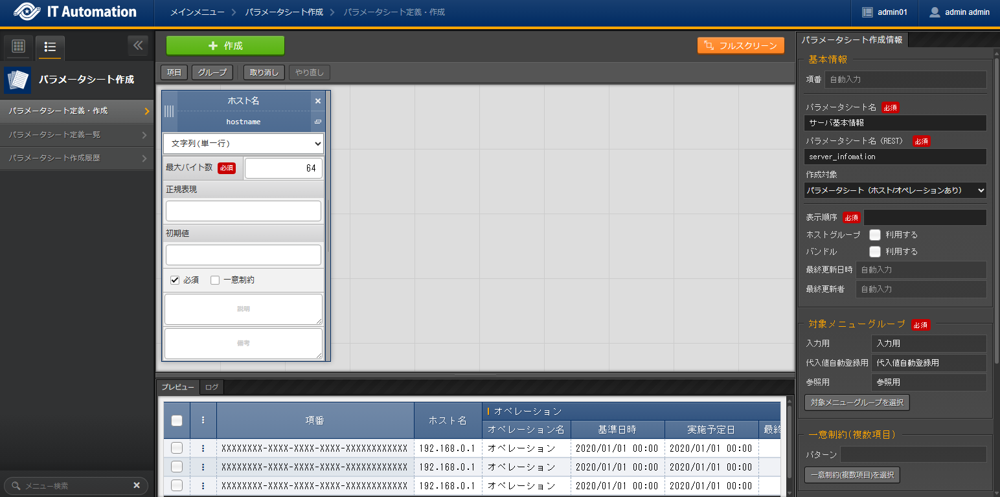
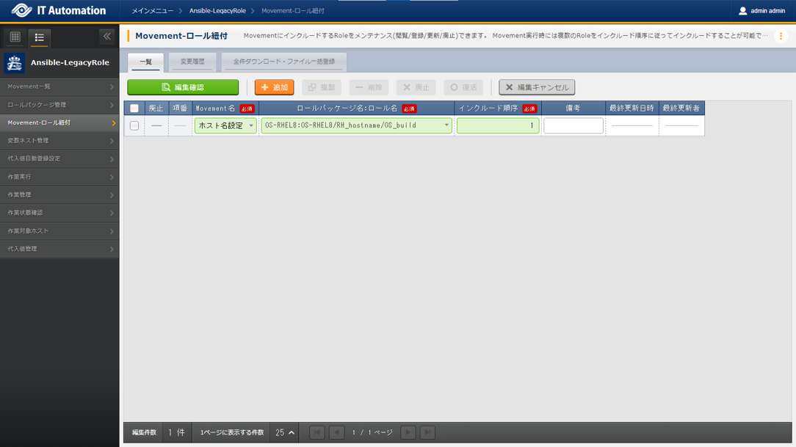

============
Host name management
============

| This document will use an easy to follow to example to teach the reader how to use the basic Exastro IT Automation functions. In the scenario, they will configure a host name.

Create Execution overview
==============

| Before configuring any specific parameters, we recommend users planning the execution.
| Start with organizing information such as what action should be executed to what device and such.

.. list-table:: Execution plan
   :widths: 15 10
   :header-rows: 0

   * - Execution date
     - 2023/04/01 12:00:00
   * - Execution target
     - server01(RHEL8)
   * - Execution contents
     - Change host name

Register execution overview
------------

| Registering Operations defined the actions that will be executed..
| Use the previous Execution plan to input information for the Operation.

.. glossary:: Operation
   An Operation is the action performed when executed. Operations are linked with the Execution target and Parameters.

| From the :menuselection:`Basic console --> Operation list` menu, register a name for the Execution and an Execution date.

.. figure:: ../../../../images/learn/quickstart/scenario1/オペレーション登録.gif
   :width: 1200px
   :alt: Register operation

.. list-table:: Operation registration contents
   :widths: 15 10
   :header-rows: 1

   * - Operation name
     - Execution date
   * - :kbd:`Change RHEL8 host name `
     - :kbd:`2023/04/01 12:00:00`

.. tip::
   | For this scenario, the Execution date can be set to any date. However, we recommend inputing dates that reflects when it will actually happen for real life scenarios.
   | If the user have no specific dates, the current date can be registered as the Execution date.

Design Parameters
==============

| Design the format of the System construction information.

| There is no need to manage all the information on the systen as parameters right now. We recommend the user adds information and registers additional information as they need it. 

.. _quickstart_server_information_parmeter:

Create Parameter sheet
----------------------

| In the :menuselection:`Create Parameter sheet` menu, users can manage parameter sheets used to register setting values (parameters) used when executing.

.. glossary:: Parameter sheet
   Parameter sheets are data structures that manages System parameter information.

| Create a Parameter sheet for managing Host name information.
| From the :menuselection:`Create Parameter sheet --> Define/Create Parameter sheet` menu, create a parameter sheet called "Server basic information" for managing host names.

.. list-table:: Create Parameter sheet (Server basic information) item setting value
   :widths: 10 10
   :header-rows: 1

   * - Setting item
     - Item 1 setting value
   * - Item name
     - :kbd:`Host name`
   * - Item name(Rest API) 
     - :kbd:`hostname`
   * - Input method
     - :kbd:`String (single line)`
   * - Maximum bytes
     - :kbd:`64`
   * - Regular expression
     - 
   * - Default value
     - 
   * - Required
     - ✓
   * - Unique constraint
     - 
   * - Description
     - 
   * - Remarks
     - 

.. list-table:: Parameter sheet(server basic information) creation information and setting value
   :widths: 5 10
   :header-rows: 1

   * - Setting contents
     - Setting value
   * - Item number
     - (Automatic)
   * - Menu name
     - :kbd:`Server basic information`
   * - Menu name(REST)
     - :kbd:`server_information`
   * - Creation target
     - :kbd:`Parameter sheet (with host/operation)`
   * - Display order
     - :kbd:`1`
   * - Using bundles
     - Do not tick "Use"(not active)
   * - Last updated date
     - (Automatic)
   * - Last updated by
     - (Automatic)

Register execution target
==============

| Register the device that will have actions executed to them.

Register Device information
--------

| Register the execution target server ,server01, to the Device list.

| From the :menuselection:`Ansible common --> Device list` menu, register connection information for server01 (execution target).

.. figure:: ../../../../images/learn/quickstart/scenario1/機器一覧登録.gif
   :width: 1200px
   :alt: Register Device list

.. list-table:: Device list setting values
   :widths: 10 10 20 10 10 20
   :header-rows: 3

   * - HW device type
     - Host name
     - IP address
     - Login password
     - 
     - Ansible use information
   * - 
     - 
     - 
     - User
     - Password
     - Legacy/Role use information
   * - 
     - 
     - 
     - 
     - 
     - Authentication method
   * - :kbd:`SV`
     - :kbd:`server01`
     - :kbd:`192.168.0.1` ※Configure appropriate IP address
     - :kbd:`root`
     - (Password)
     - :kbd:`Password authentication`

Register work procedure
==============

| In order to register work procedures, we need to define Movements (Jobs) used by Exastro IT Automation.
| We will link Ansible role packages to the defined Movements. By doing this, we can link the variables within the Ansible Role package together with the Parameter sheet items registered in :ref:`quickstart_server_information_parmeter`.

.. glossary:: Movement
   Movements are the smallet units of operations used by Exastro IT Automation.
   One Movement execution is the same as executing 1 Ansible-Playbook command.

Configure execution items
--------------

| In Exastro IT Automation, actions performed to the target machines are managed as units called Movements, which corresponds to the execution items in the manuals.
| Movement are linked to IaC (Infrastructure as Code) files, such as Ansible Playbook. They are then used together by linking the Variables within the IaC files and the Parameter sheet setting values.

| From :menuselection:`Ansible-LegacyRole --> Movement list`, register a Movement for configuring the Host name.
.. figure:: ../../../../images/learn/quickstart/scenario1/Movement登録.png
   :width: 1200px
   :alt: Movement registration

.. list-table:: Movement information setting value
   :widths: 10 10
   :header-rows: 2
 
   * - Movement name
     - Ansible use information
   * - 
     - Host specification format
   * - :kbd:`Host name specification`
     - :kbd:`IP`

Register Ansible Role
-----------------

| Register an Ansible Role. Ansible Roles corresponds to the Commands written within the operation manuals.
| While it is possible to create Ansible Roles from scratch, the Ansible Legacy-Role mode is created for executing already created Ansible roles.
| In this scenario, we will use `Exastro Playbook Collection <https://github.com/exastro-suite/playbook-collection-docs/blob/master/ansible_role_packages/README.md>`_. 

| `Click here to download the Ansible Role Package's OS-RHEL8 <https://github.com/exastro-playbook-collection/OS-RHEL8/releases/download/v23.03/OS-RHEL8.zip>`_. 

| Register the `OS-RHEL8.zip <https://github.com/exastro-playbook-collection/OS-RHEL8/releases/download/v23.03/OS-RHEL8.zip>`_ file downloaded from :menuselection:`Ansible-LegacyRole --> Role package management`.

.. figure:: ../../../../images/learn/quickstart/scenario1/ロールパッケージ管理.gif
   :width: 1200px
   :alt: Role package management

.. list-table:: Ansible Role package information registration
  :widths: 10 20
  :header-rows: 1

  * - Role package name
    - Role package file (ZIP format)
  * - :kbd:`OS-RHEL8`
    - :file:`OS-RHEL8.zip`

Link Movement and Ansible Role
---------------------------------

| From the :menuselection:`Ansible-LegacyRole --> Movement-Role link` menu, register a link between the Movement and the Ansible Role package.
| In this scenario, we will use `Ansible Role Package for Host name management <https://github.com/exastro-playbook-collection/OS-RHEL8/tree/master/RH_hostname/OS_build>`_.

.. list-table:: Movement-role link information registration
  :widths: 10 30 10
  :header-rows: 1

  * - Movement name
    - Role package name:Role name
    - Include order
  * - :kbd:`Host name settings`
    - :kbd:`OS-RHEL8:OS-RHEL8/RH_hostname/OS_build`
    - :kbd:`1`

Link Ansible Role variables and Parameter sheet items
----------------------------------------------------

| By substituting :kbd:`VAR_RH_hostname` variable within the OS-RHEL8 Ansible Role package, we can configure the target server's host name.

| From the :menuselection:`Ansible-LegacyRole --> Substitute value auto registration settings` menu, configure the "Server basic information" parameter sheet's "Host name" item so it substitutes the Ansible Role package's :kbd:`VAR_RH_hostname`.

.. figure:: ../../../../images/learn/quickstart/scenario1/代入値自動登録設定.gif
   :width: 1200px
   :alt: Substitute value auto registration settings

.. list-table:: Substitute auto registration settings setting value 代入値自動登録設定の設定値
  :widths: 40 10 20 20 30
  :header-rows: 2

  * - Parameter sheet(From)
    - Registration method
    - Movement name
    - IaC variable(To)
    -
  * - Menu group:Menu:Item
    -
    -
    - Movement name:Variable name
    - Movement name:Variable name:Member variable
  * - :kbd:`Substitute value auto registration:Server basic information:Host name`
    - :kbd:`Value type`
    - :kbd:`Host name settings`
    - :kbd:`Host name settings:VAR_RH_hostname`
    - 

Change Host name(2st execution)
===========================

| Parameter sheets registers parameters for each device they want to configure values to.
| In this scenario, we will configure the host name :kbd:`server01` to the RHEL8.

Configure Parameters
--------------

| From the :menuselection:`Input --> Server basic information` menu, register a Parameter to the host.

.. figure:: ../../../../images/learn/quickstart/scenario1/パラメータ登録.gif
   :width: 1200px
   :alt: Parameter registration

.. list-table:: Server basic information parameter setting values
  :widths: 5 20 5
  :header-rows: 2

  * - Host name
    - Operation
    - Parameter
  * - 
    - Operation name
    - Host name
  * - server01
    - :kbd:`2023/04/01 12:00:00_Change_RHEL8_host_name`
    - :kbd:`server01`

Execute
--------

1. Pre-execution confirmation

   | Before executing check the status of the server
   | SSH login to the server and check the current host name.

   .. code-block:: bash
      :caption: Command

      # Fetch host name
      hostnamectl status --static

   .. code-block:: bash
      :caption: Execution results

      # Results depends on environment
      localhost

2. Execute

   | From :menuselection:`Ansible-LegacyRole --> Execute`, select the :kbd:`Host name Settings` Movement and press the :guilabel:` Execute` button.
   | Next, in :menuselection:`Execution settings`, select the :kbd:`Change RHEL8 host name` Operation and press the :guilabel:`Execute` button.

   | Open the :menuselection:`Check execution status` page and check that the status says "Complete".

.. figure:: ../../../../images/learn/quickstart/scenario1/作業実行.gif
   :width: 1200px
   :alt: Execute

3. Post-execution confirmation

   | Access the server again and check that the Host name has been changed.

   .. code-block:: bash
      :caption: Command

      # Fetch host name
      hostnamectl status --static

   .. code-block:: bash
      :caption: Execution results

      server01

Change Host name(2nd execution)
===========================

| In this scenario, the host name :kbd:`server01` is configured as a Parameter value.
| However, that host name is also managed in :menuselection:`Device list`, meaning that the host name is overlapping.

| In Exastro IT Automation, useres can fetch device information with :ref:`ansible_common_ita_original_variable` and fetch the login destination' host name variable (:kbd:`__inventory_hostname__`), meaning that the system can centrally manage the both of the parameters.

Configure Parameters
--------------

| From the :menuselection:`Input --> Server basic information` menu, use ITA's original variable to register a host name regsitered in the Device list.

.. figure:: ../../../../images/learn/quickstart/scenario1/パラメータ設定.png
   :width: 1200px
   :alt: Parameter configuration

.. list-table:: Server basic information parameter setting value
  :widths: 5 10 5
  :header-rows: 2

  * - Host name
    - Operation
    - Parameter
  * - 
    - Operation name
    - Host name
  * - :kbd:`server01`
    - :kbd:`2023/04/01 12:00:00_Change_RHEL8_host_name`
    - :kbd:`"{{ __inventory_hostname__ }}"`

Edit device information
--------------

| Change the Target server (server01) host name to db01.

| From the :menuselection:`Ansible common --> Device list` menu, change the Target server (server01) host name to db01.

.. figure:: ../../../../images/learn/quickstart/scenario1/機器一覧変更.png
   :width: 1200px
   :alt: Parameter registration

.. list-table:: Device list setting value
   :widths: 10 10 20 10 10 20
   :header-rows: 3

   * - HW device type
     - Host name
     - IP address
     - Login password login password
     - 
     - Ansible use information
   * - 
     - 
     - 
     - User
     - Password
     - Legacy/Role use information
   * - 
     - 
     - 
     - 
     - 
     - Authentication method
   * - :kbd:`SV`
     - :kbd:`db01`
     - :kbd:`192.168.0.1` ※Confiure an appropriate IP address
     - :kbd:`root`
     - (Password)
     - :kbd:`Password authentication`

Execution
--------

1. Execute

   | From :menuselection:`Ansible-LegacyRole --> Execute`, select the :kbd:`Host name Settings` Movement and press the :guilabel:` Execute` button.
   | Next, in :menuselection:`Execution settings`, select the :kbd:`Change RHEL8 host name` Operation and press the :guilabel:`Execute` button.

   | Open the :menuselection:`Check execution status` page and check that the status says "Complete".

.. figure:: ../../../../images/learn/quickstart/scenario1/作業実行.gif
   :width: 1200px
   :alt: Execute

2. Post-execution confirmation

   | Access the server again and check that the Host name has been changed.

   .. code-block:: bash
      :caption: Command

      # Fetch host name
      hostnamectl status --static

   .. code-block:: bash
      :caption: Execution results

      db01

| By doing this, users canchange host names from the  :menuselection:`Ansible common --> Device list` and update the host name just be executing a Ansible through ITA.

Summary
======

| This scenario taught the reader the basics of using Exastro IT Automation by guiding them through a scenario configuring the host name of a RHEL8 server.
| In the :doc:`next scenario <scenario2>`, the user will be guided through a scenario where they will manage more useful parameter sheets.