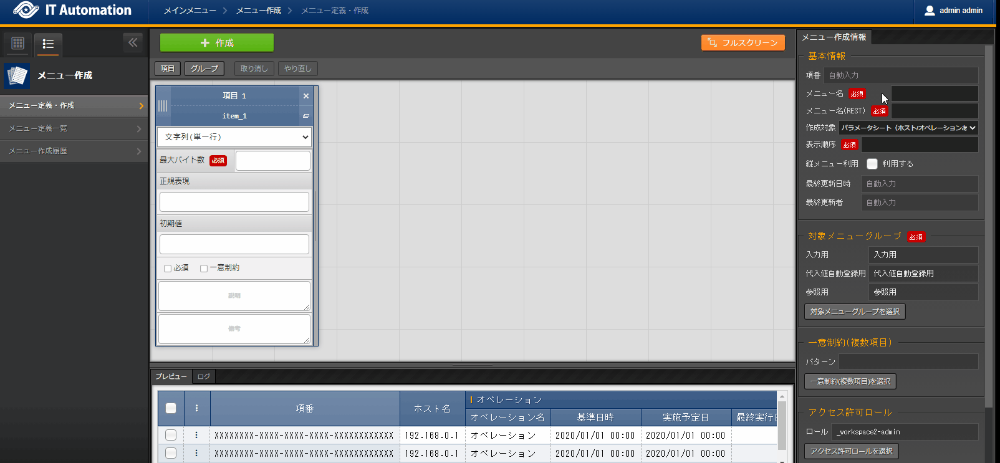
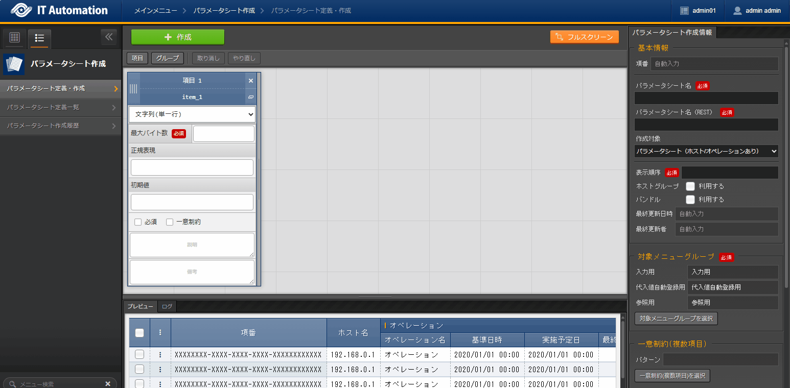
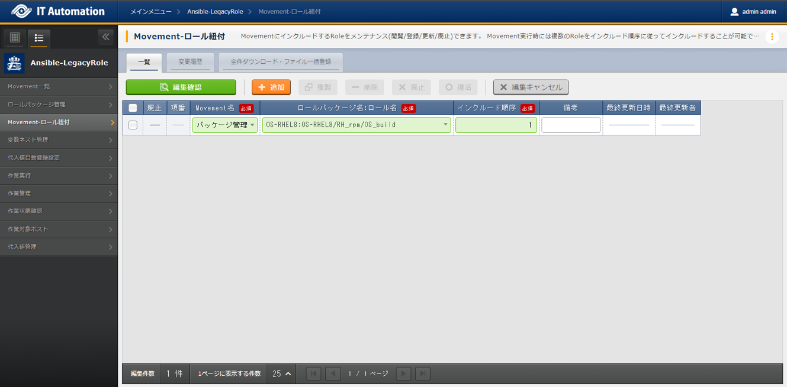
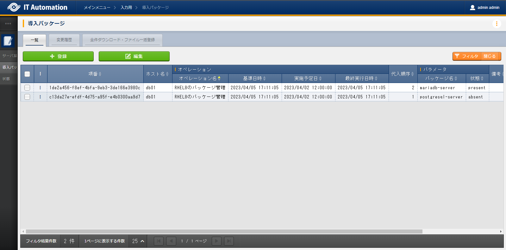

==============
Package management
==============

| This document will teach the reader how to use Exastro IT Automation by guiding them through a scenario where they will install and uninstall packages and manage practical parameter sheets.

.. tip:: We recommend completing the :doc:`previous scenario <scenario1>` before starting this one.

Create Execution overview
==============

| Same as in the :doc:`previous scenario <scenario1>` start planning the execution.

.. list-table:: Execution plan
   :widths: 15 10
   :header-rows: 0

   * - Execution date
     - 2023/04/02 12:00:00
   * - Execution target
     - db01(RHEL8)
   * - Execution contents
     - Install/Uninstall package

Register execution overview
------------

| From the :menuselection:`Basic console --> Operation list` menu, register a name for the Execution and an Execution date.

.. figure:: ../../../../images/learn/quickstart/scenario2/オペレーション登録.png
   :width: 1200px
   :alt: Register Operation

.. list-table:: Operation registration contents
   :widths: 15 10
   :header-rows: 1

   * - Operation name
     - Execution date
   * - :kbd:`Manage RHEL8 package`
     - :kbd:`2023/04/02 12:00:00`

Design Parameters
==============

| This scenario uses 2 different parameter sheet setting items. "Package name" and "Ideal install state".
| The user should think of the following:

- Managing either "Status when installed" or "Status when not installed" for the "Ideal install state".
- Manaing indefinete packages

| In the next sections we will see how we can design parameter sheets that can focus on the points above.

Creating options
------------

| When manually registering Parameters, there will always be a chance of operations failing or not doing the right thing because of typing errors and other faults.
| By making Parameters selectable, we can prevent typing errors.

| First, create selectable options. :kbd:`present` for "Ideal install state" (When installed) amd  :kbd:`absent`for "Status when not installed".
| More specifically, we will create a Data sheet and then input parameters that will serve as selectable options.

.. glossary:: Data sheet
   Data sheets are data structures that manages fixed data parameters used by Exastro IT Automation.

.. _quickstart_create_datasheet:

Create Data sheet
^^^^^^^^^^^^^^^^^^

| Create Data sheet

| From the :menuselection:`Create Parameter sheet --> Define/Create Parameter sheet` menu, create a Data sheet.

.. list-table:: Data sheet item setting values
   :widths: 10 10
   :header-rows: 1

   * - Setting item
     - Item 1 setting value
   * - Item name
     - :kbd:`present-absent`
   * - Item name(Rest API) 
     - :kbd:`present-absent`
   * - Input method
     - :kbd:`String (single line)`
   * - Maximum bytes
     - :kbd:`16`
   * - Regular expression
     - 
   * - Initial value
     - 
   * - Required
     - ✓
   * - Unique constraint
     - ✓
   * - Description
     - 
   * - Remarks
     - 

.. list-table:: Paramete sheet creation information and setting values
   :widths: 5 10
   :header-rows: 1

   * - Item name
     - Setting value
   * - Item number
     - (Automatic)
   * - Menu name
     - :kbd:`State`
   * - Menu name(REST)
     - :kbd:`state`
   * - Creation target
     - :kbd:`Data sheet`
   * - Display order
     - :kbd:`99999`
   * - Last updated date
     - (Automatic)
   * - Last updated by
     - (Automatic)

Registering options
^^^^^^^^^^^^

| Configure Parameters that will be displayed in the Parameter list.
| From the :menuselection:`Input --> State` menu, register the package's Ideal install state.

.. figure:: ../../../../images/learn/quickstart/scenario2/選択肢を登録.gif
   :width: 1200px
   :alt: Option registration

.. list-table:: Status setting values
   :widths: 10 10
   :header-rows: 2

   * - Parameter
     - Remarks
   * - present-absent
     - 
   * - :kbd:`present`
     - Install
   * - :kbd:`absent`
     - Uninstall

Create Parameter sheet
----------------------

| When managing parameters for server and network devices, multiple parameters might exist for single setting items.

| For example, users might have to manage data which there exist multiple of on a system (IP address, User, etc).
| If the user wants to manage parameters like these in a table format, they must also consider the fact that such data might increase, meaning that they will have to increase the items in a table. 
| This complicate the format fast, as the user will have to keep editing and adding items to it.

| This is where we can use bundled parameter sheets, a method for managing multiple parameters in a smarter way.

| From the :menuselection:`Create Parameter sheet --> Define/Create Parameter sheet` menu, regsiter a Parameter sheet.
| By setting the :menuselection:`Input method` for Item 1 to :kbd:`Pulldown selection` users can refer to the data sheet registered in :menuselection:`Input method`.

.. list-table:: Parameter item settings
   :widths: 10 10 10
   :header-rows: 1
   :class: filter-table

   * - Setting item
     - Item 1 setting value
     - Item 2 setting value
   * - Item name
     - :kbd:`Package name`
     - :kbd:`State`
   * - Item name(Rest API) 
     - :kbd:`package_name`
     - :kbd:`state`
   * - Input method
     - :kbd:`String (single line)`
     - :kbd:`Pulldown selection`
   * - Maximum bytes
     - :kbd:`64`
     - (No item)
   * - Regular expression
     - 
     - (No item)
   * - Selection item
     - (No item)
     - :kbd:`Input:State:present-absent`
   * - Reference item
     - (No item)
     - 

   * - Default value
     - 
     - 
   * - Required
     - ✓
     - ✓
   * - Unique constraint
     - 
     - 
   * - Description
     - 
     - 
   * - Remarks
     - 
     - 

| By ticking the "use" for :menuselection:`Use bundles`, the parameter sheet can have multiple parameters configured to a single setting item.

.. figure:: ../../../../images/learn/quickstart/scenario2/パラメータシート作成情報設定.png
   :width: 1200px
   :alt: Configuring Parameter sheet creation information.

.. list-table:: Parameter sheet creation information setting value
   :widths: 5 10
   :header-rows: 1
   :class: filter-table

   * - Item name
     - Setting value
   * - Item number
     - (Automatic)
   * - Menu name
     - :kbd:`Insert Package
   * - Menu name(REST)
     - :kbd:`packages`
   * - Creation target
     - :kbd:`Parameter sheet (with host/operation)`
   * - Display order
     - :kbd:`2`
   * - Using bundles
     - Tick "Use"(active)
   * - Last updated date
     - (Automatic)
   * - Last updated by
     - (Automatic)

Register execution target
==============

| Register the device that will have actions executed to them.

Register Device
--------

| The Execution target in this scenario is the same one registered in the :doc:`previous scenario <scenario1>` (db01), meaning the user doesnt need to do anything.

Register work procedure
==============

| In order to register work procedures, we need to define Movements (Jobs) used by Exastro IT Automation.
| We will link Ansible role packages to the defined Movements. By doing this, we can link the variables within the Ansible Role package together with the Parameter sheet items registered in :ref:`quickstart_server_information_parmeter`.

Register Movement
-------------

| From the :menuselection:`Ansible-LegacyRole --> Movement list` menu, registerr a Movement for configuring host names.

.. figure:: ../../../../images/learn/quickstart/scenario2/Movement登録.png
   :width: 1200px
   :alt: Movement registration

.. list-table:: Movement information setting value
   :widths: 10 10
   :header-rows: 2

   * - Movement name
     - Ansible use information
   * - 
     - Host specification format
   * - :kbd:`Manage Package`
     - :kbd:`IP`

Register Ansible Role 
-----------------

| In this scenario, we will use the `Exastro Playbook Collection <https://github.com/exastro-suite/playbook-collection-docs/blob/master/ansible_role_packages/README.md>`_ role package from the :doc:`previous scenario <scenario1>`. 

Link Movement and Ansible Role
---------------------------------

| From the :menuselection:`Ansible-LegacyRole --> Movement-Role link` menu, register a link between the Movement and the Ansible Role package.
| In this scenario, we will use the `RPM management Ansible Role package <https://github.com/exastro-playbook-collection/OS-RHEL8/tree/master/RH_rpm/OS_build>`_.

.. list-table:: Movement-role link information registration
  :widths: 10 30 10
  :header-rows: 1

  * - Movement name
    - Role package name:Role name
    - Include order
  * - :kbd:`Manage package`
    - :kbd:`OS-RHEL8:OS-RHEL8/RH_rpm/OS_build`
    - :kbd:`1`

Variable nest management
--------------

| As we can configure 1 host name per server, VAR_RH_hostname will be defined to be handled as a normal variable.

.. code-block:: yaml
   :caption: VAR_RH_hostname variable structure

   # Only 1 value for VAR_RH_hostname 
   VAR_RH_hostname: myhostname

| On the other hand, as it is quite normal to manage multiple packages on a single server, VAR_RH_rpm will be defined to be handled as a multistage variable that can manage variable sets in arrays.

.. code-block:: yaml
   :caption: VAR_RH_rpm variable structure (=multistage variable)

   # Variable set (action and pkg_name) loops to VAR_RH_rpm with no set number.
   VAR_RH_rpm:
   - action: absent
     pkg_name: httpd
   - action: present
     pkg_name: vsftpd
     ...

| For multistage variables such as VAR_RH_rpm, we will have to set a limit on beforehand.
| In this scenario, we will configure the amount of managed packages to 10.

| From the :menuselection:`Ansible-LegacyRole --> Variable nest management` menu, configure maximum number of managed packages.

.. figure:: ../../../../images/learn/quickstart/scenario2/変数ネスト管理.gif
   :width: 1200px
   :alt: Variable nest management

.. list-table:: Registering Variable nest information
   :widths: 10 10 20 10
   :header-rows: 1

   * - Movement name
     - Variable name
     - Member variable name (with repetitions)
     - Maximum repetitions
   * - Package management
     - VAR_RH_rpm
     - 0
     - :kbd:`10`

Substitute value auto registration settings
------------------

| In the OS-RHEL8 Ansible Role package, we can substitute the :kbd:`VAR_RH_rpm` variable with a managed package name and state in order to configure the target server's host name.

| From the :menuselection:`Ansible-LegacyRole --> Substitute value auto registration settings` menu, link the variables within the Ansible Role Package's :kbd:`VAR_RH_rpm` together with the Insert package parametersheet's Package name and Status item parameters.

.. figure:: ../../../../images/learn/quickstart/scenario2/代入値自動登録設定.png
   :width: 1200px
   :alt: Substitute value auto registration settings

.. list-table:: Substitute value auto registration settings Setting values
  :widths: 40 10 10 20 20 30
  :header-rows: 2

  * - Parameter sheet(From)
    -
    - Registration method
    - Movement name
    - IaC variable(To)
    -
  * - Menu group:Menu:Item
    - Substitute order
    -
    -
    - Movement name:Variable name
    - Movement name:Variable name:Member variable
  * - :kbd:`Substitute value auto registration:Insert Package:Package name`
    - :kbd:`1`
    - :kbd:`Value type`
    - :kbd:`Manage Package`
    - :kbd:`Manage Package:VAR_RH_rpm`
    - :kbd:`Manage Package:VAR_RH_rpm:[0].pkg_name`
  * - :kbd:`Substitute value auto registration:Insert Package:State`
    - :kbd:`1`
    - :kbd:`Value type`
    - :kbd:`Manage Package`
    - :kbd:`Manage Package:VAR_RH_rpm`
    - :kbd:`Manage Package:VAR_RH_rpm:[0].action`
  * - :kbd:`Substitute value auto registration:Insert Package:Package name`
    - :kbd:`2`
    - :kbd:`Value type`
    - :kbd:`Manage Package`
    - :kbd:`Manage Package:VAR_RH_rpm`
    - :kbd:`Manage Package:VAR_RH_rpm:[1].pkg_name`
  * - :kbd:`Substitute value auto registration:Insert Package:State`
    - :kbd:`2`
    - :kbd:`Value type`
    - :kbd:`Manage Package`
    - :kbd:`Manage Package:VAR_RH_rpm`
    - :kbd:`Manage Package:VAR_RH_rpm:[1].action`
  * - :kbd:`Substitute value auto registration:Insert Package:Package name`
    - :kbd:`3`
    - :kbd:`Value type`
    - :kbd:`Manage Package`
    - :kbd:`Manage Package:VAR_RH_rpm`
    - :kbd:`Manage Package:VAR_RH_rpm:[2].pkg_name`
  * - :kbd:`Substitute value auto registration:Insert Package:State`
    - :kbd:`3`
    - :kbd:`Value type`
    - :kbd:`Manage Package`
    - :kbd:`Manage Package:VAR_RH_rpm`
    - :kbd:`Manage Package:VAR_RH_rpm:[2].action`
  * - :kbd:`Substitute value auto registration:Insert Package:Package name`
    - :kbd:`4`
    - :kbd:`Value type`
    - :kbd:`Manage Package`
    - :kbd:`Manage Package:VAR_RH_rpm`
    - :kbd:`Manage Package:VAR_RH_rpm:[3].pkg_name`
  * - :kbd:`Substitute value auto registration:Insert Package:State`
    - :kbd:`4`
    - :kbd:`Value type`
    - :kbd:`Manage Package`
    - :kbd:`Manage Package:VAR_RH_rpm`
    - :kbd:`Manage Package:VAR_RH_rpm:[3].action`
  * - :kbd:`Substitute value auto registration:Insert Package:Package name`
    - :kbd:`5`
    - :kbd:`Value type`
    - :kbd:`Manage Package`
    - :kbd:`Manage Package:VAR_RH_rpm`
    - :kbd:`Manage Package:VAR_RH_rpm:[4].pkg_name`
  * - :kbd:`Substitute value auto registration:Insert Package:State`
    - :kbd:`5`
    - :kbd:`Value type`
    - :kbd:`Manage Package`
    - :kbd:`Manage Package:VAR_RH_rpm`
    - :kbd:`Manage Package:VAR_RH_rpm:[4].action`
  * - :kbd:`Substitute value auto registration:Insert Package:Package name`
    - :kbd:`6`
    - :kbd:`Value type`
    - :kbd:`Manage Package`
    - :kbd:`Manage Package:VAR_RH_rpm`
    - :kbd:`Manage Package:VAR_RH_rpm:[5].pkg_name`
  * - :kbd:`Substitute value auto registration:Insert Package:State`
    - :kbd:`6`
    - :kbd:`Value type`
    - :kbd:`Manage Package`
    - :kbd:`Manage Package:VAR_RH_rpm`
    - :kbd:`Manage Package:VAR_RH_rpm:[5].action`
  * - :kbd:`Substitute value auto registration:Insert Package:Package name`
    - :kbd:`7`
    - :kbd:`Value type`
    - :kbd:`Manage Package`
    - :kbd:`Manage Package:VAR_RH_rpm`
    - :kbd:`Manage Package:VAR_RH_rpm:[6].pkg_name`
  * - :kbd:`Substitute value auto registration:Insert Package:State`
    - :kbd:`7`
    - :kbd:`Value type`
    - :kbd:`Manage Package`
    - :kbd:`Manage Package:VAR_RH_rpm`
    - :kbd:`Manage Package:VAR_RH_rpm:[6].action`
  * - :kbd:`Substitute value auto registration:Insert Package:Package name`
    - :kbd:`8`
    - :kbd:`Value type`
    - :kbd:`Manage Package`
    - :kbd:`Manage Package:VAR_RH_rpm`
    - :kbd:`Manage Package:VAR_RH_rpm:[7].pkg_name`
  * - :kbd:`Substitute value auto registration:Insert Package:State`
    - :kbd:`8`
    - :kbd:`Value type`
    - :kbd:`Manage Package`
    - :kbd:`Manage Package:VAR_RH_rpm`
    - :kbd:`Manage Package:VAR_RH_rpm:[7].action`
  * - :kbd:`Substitute value auto registration:Insert Package:Package name`
    - :kbd:`9`
    - :kbd:`Value type`
    - :kbd:`Manage Package`
    - :kbd:`Manage Package:VAR_RH_rpm`
    - :kbd:`Manage Package:VAR_RH_rpm:[8].pkg_name`
  * - :kbd:`Substitute value auto registration:Insert Package:State`
    - :kbd:`9`
    - :kbd:`Value type`
    - :kbd:`Manage Package`
    - :kbd:`Manage Package:VAR_RH_rpm`
    - :kbd:`Manage Package:VAR_RH_rpm:[8].action`
  * - :kbd:`Substitute value auto registration:Insert Package:Package name`
    - :kbd:`10`
    - :kbd:`Value type`
    - :kbd:`Manage Package`
    - :kbd:`Manage Package:VAR_RH_rpm`
    - :kbd:`Manage Package:VAR_RH_rpm:[9].pkg_name`
  * - :kbd:`Substitute value auto registration:Insert Package:State`
    - :kbd:`10`
    - :kbd:`Value type`
    - :kbd:`Manage Package`
    - :kbd:`Manage Package:VAR_RH_rpm`
    - :kbd:`Manage Package:VAR_RH_rpm:[9].action`

| Registering this amount of data through the WebUI will take a lot of time.
| We recommend the user use "Download all" and "File bulk registration" function to register large amounts of data at once.

.. figure:: ../../../../images/learn/quickstart/scenario2/代入値自動登録設定_一括登録.gif
   :width: 1200px
   :alt: Substitute value auto registration settings(Bulk registration)

Install packages (1st time)
===================================

| First in, the Parameter sheet, we will register the desired values to the parameter for each device.
| In this scenario, we will install a package called :kbd:`postgresql-server` to the db01 host and construct a DB server.

Configure Parameters
--------------

| From :menuselection:`Input --> Insert Package` register Parameters for the host.

.. figure:: ../../../../images/learn/quickstart/scenario2/パラメータ設定.gif
   :width: 1200px
   :alt: Parameter settings

.. list-table:: Insert Package parameter setting values
  :widths: 5 20 5 10 5
  :header-rows: 2

  * - Host name
    - Operation
    - Input order
    - Parameter
    - 
  * - 
    - Operation name
    - 
    - Package name
    - State
  * - db01
    - :kbd:`2023/04/02 12:00:00_Manage RHEL8 package`
    - :kbd:`1`
    - :kbd:`postgresql-server`
    - :kbd:`present`

Execute
--------

1. Pre-execution confirmation

   | First, check the current state of the server.
   | SSH login to the server and check the installation status of postgresql-server

   .. code-block:: bash
      :caption: Command

      rpm -q postgresql-server

   .. code-block:: bash
      :caption: Execution results

      package postgresql-server is not installed

2. Execute

   | From :menuselection:`Ansible-LegacyRole --> Execute`, select the :kbd:`Manage package` Movement and press the :guilabel:` Execute` button.
   | Next, in :menuselection:`Execution settings`, select the :kbd:`Manage RHEL8 host name` Operation and press the :guilabel:`Execute` button.

   | Open the :menuselection:`Check execution status` page and check that the status says "Complete".

   .. figure:: ../../../../images/learn/quickstart/scenario2/作業実行.gif
      :width: 1200px
      :alt: Execute

3. Post-execution confirmation

   | Access the server again and check and check the postgresql-server installation status. It should be installed.

   .. code-block:: bash
      :caption: Command

      rpm -q postgresql-server

   .. code-block:: bash
      :caption: Execution results

      # Version differs depending on the environment
      postgresql-server-10.23-1.module+el8.7.0+17280+3a452e1f.x86_64

Install packages (2nd time)
===================================

| In the previous section, we installed the :kbd:`postgresql-server` package to db01 and constructed a DB server.
| However, what if we need to change it to mariadb-server instead of postgresql-server.

Configure Parameter
--------------

| From :menuselection:`Input  --> Insert Package` reigster new parameters.

.. list-table:: Insert Package parameter setting values
  :widths: 5 20 5 10 5
  :header-rows: 2

  * - Host name
    - Operation
    - Substitute order
    - Parameter
    - 
  * - 
    - Operation name
    - 
    - Package name
    - State
  * - db01
    - :kbd:`2023/04/02 12:00:00_Manage RHEL8 package`
    - :kbd:`1`
    - :kbd:`postgresql-server`
    - :kbd:`absent`
  * - db01
    - :kbd:`2023/04/02 12:00:00_Manage RHEL8 package`
    - :kbd:`2`
    - :kbd:`mariadb-server`
    - :kbd:`present`

Execute
--------

1. Pre-execution confirmation

   | Check the current status of the Server.
   | SSH login to the server and check the installation status of postgresql-server.

   .. code-block:: bash
      :caption: Command

      rpm -q postgresql-server

   .. code-block:: bash
      :caption: Execution results

      # Differs depending on the version
      postgresql-server-10.23-1.module+el8.7.0+17280+3a452e1f.x86_64

   .. code-block:: bash
      :caption: Command

      rpm -q mariadb-server

   .. code-block:: bash
      :caption: Execution results

      package mariadb-server is not installed

2. Execute

   | From :menuselection:`Ansible-LegacyRole --> Execute`, select the :kbd:`Manage package` Movement and press the :guilabel:` Execute` button.
   | Next, in :menuselection:`Execution settings`, select the :kbd:`Manage RHEL8 host name` Operation and press the :guilabel:`Execute` button.

   | Open the :menuselection:`Check execution status` page and check that the status says "Complete".

   .. figure:: ../../../../images/learn/quickstart/scenario2/作業実行2.gif
      :width: 1200px
      :alt: Execute2

3. Post-execution confirmation

   | Access the server again and check and check the the package statues. postgresql-server should be uninstalled and mariadb-server should be installed.

   .. code-block:: bash
      :caption: Command

      rpm -q postgresql-server

   .. code-block:: bash
      :caption: Execution results

      package postgresql-server is not installed

   .. code-block:: bash
      :caption: Command

      rpm -q mariadb-server

   .. code-block:: bash
      :caption: Execution results

      mariadb-server-10.3.35-1.module+el8.6.0+15949+4ba4ec26.x86_64

Summary
======

| This scenario taught the reader how to use more practical and advanced Parameter sheets in Exastro IT Automation by guiding then through a scenario where they managed packages on a RHEL 8 server.

- For cases where the input values are already decided, users can use Data sheets in order to prevent typing mistakes.
- For cases where users have to manage multiple indefinite parameters, they can use bundles to manage parameters more flexibly.
- For cases where the user have to configure large amounts of parameters,they can use 「"Download all/File bulk registration" function to register data from a file.

| In the :doc:`next scenario <scenario3>` the user will be guided through a scenario where they will execute a series of jobs.
