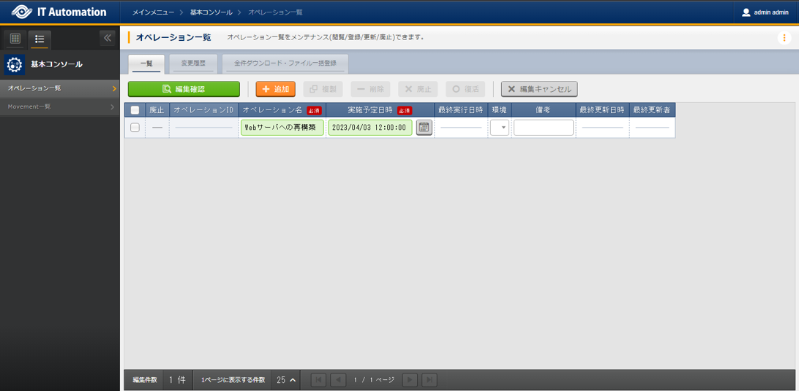
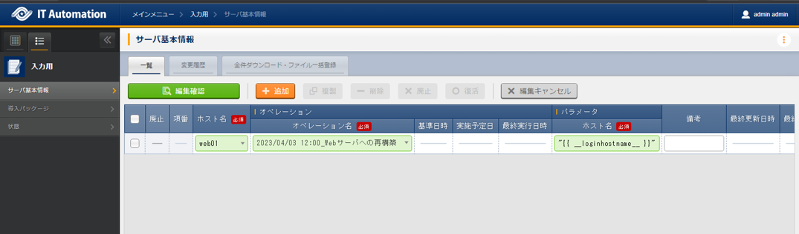
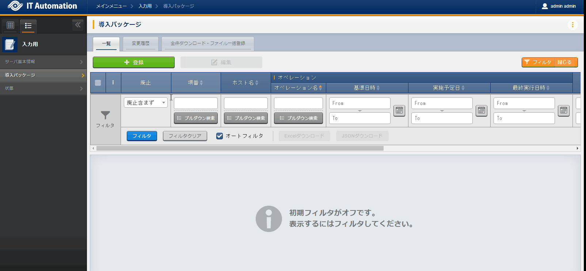

============
Jobflow
============

| This document will use the data base server created in the :doc:`previous scenario <scenario2>` to rebuild the web server to teach users how to execute multiple jobs in succession.
| More specifically, the we will:

1. Use the job from :doc:`scenario1` to change the host name from db01 to web01.
2. Use the Package install from :doc:`scenario2` to first uninstall the DB packages and then install packages for the Web server.

.. tip:: We recommend completing both :doc:`scenario1` and :doc:`scenario2` before starting this one.

Create Execution overview
==============

| Same as in the :doc:`previous scenario <scenario2>` start planning the execution.

.. list-table:: Execution plan
   :widths: 15 10
   :header-rows: 0

   * - Execution date
     - 2023/04/03 12:00:00
   * - Execution target
     - db01(RHEL8)
   * - Execution contents
     - Reconstruct Web server

Register execution overview
------------

| From the :menuselection:`Basic console --> Operation list` menu, register a name for the Execution and an Execution date.

.. list-table:: Operation registration contents
   :widths: 15 10
   :header-rows: 1

   * - Operation name
     - Execution date
   * - :kbd:`Reconstruct Web server`
     - :kbd:`2023/04/03 12:00:00`

Design Parameters
==============

| This scenario uses the parameter sheets (and parameter sheets) from :doc:`scenario1` and :doc:`scenario2`, meaning the user does not have to create any new parameter sheets.

Register execution target
==============

| Register the device that will have actions executed to them.

Register Device information
--------------

| While this scenario will use the "db01" server regsitered in the :doc:`previous scenario <scenario2>`, we will reconstruct the DB server to a Web server, meaning that we must change the host name.
| Change the host name from db01 to web01.

| From the :menuselection:`Ansible common --> Device list` menu, change the host name for "db01" to "web01".

.. figure:: ../../../../images/learn/quickstart/scenario3/機器情報の更新.gif
   :width: 1200px
   :alt: Edit Device information

.. list-table:: Device list setting values
   :widths: 10 10 20 10 10 20
   :header-rows: 3

   * - HW device type
     - Host name
     - IP address
     - Login password
     - 
     - Ansible use information
   * - 
     - 
     - 
     - User
     - Password
     - Legacy/Role use information
   * - 
     - 
     - 
     - 
     - 
     - Authentication method
   * - :kbd:`SV`
     - :kbd:`web01`
     - :kbd:`192.168.0.1` ※Configure appropriate IP address
     - :kbd:`root`
     - (Password)
     - :kbd:`Password authentication`

Register work procedure
==============

| This scenario uses the following Movements created in :doc:`scenario1` and :doc:`scenario2`, meaning the user doesnt have to create any new Movements.

- Configure Host name
- Manage Packages

| In the previous scenarios, we have only executed single Movements. But in this scenario, we will execute them in succession.

Create Jobflow
------------------

| We can use ITA's Conductor function to execute a Jobflow consisting of multiple Movements.
| By using Conductor, we can not only execute multiple Movements, but we can also create branches that changes depending on the results of the previous movements, pause jobflows to check information and use other advanced functions.

| From the :menuselection:`Conductor --> Edit/Execute Conductor` menu, defined a Jobflow.

.. figure:: ../../../../images/learn/quickstart/scenario3/ジョブフローの作成.gif
   :width: 1200px
   :alt: Creating Jobflow

| 1. From the upper right area, Input :kbd:`Construct Server` into :menuselection:`Conductor information --> Name`.
| 2. In the bottom right area, drag and drop the Movements :kbd:`Configure host name` and :kbd:`Manage packages` we created in :doc:`scenario1` and :doc:`scenario2` to the middle of the screen.
| 3. Connect the different nodes as seen below.
 
.. list-table:: Node connection
   :widths: 10 10
   :header-rows: 1

   * - OUT
     - IN
   * - :kbd:`Start`
     - :kbd:`Configure host name`
   * - :kbd:`Configure host name`
     - :kbd:`Manage packages`
   * - :kbd:`Manage packages`
     - :kbd:`End`

| 4. Lastly, press the :guilabel:` Register` button at the top of the page.

Execute the Server reconstruct process
========================

| While we will install an :kbd:`httpd` package to the db01 host, the previous scenario ended with us installing a :kbd:`mariadb-server` package.
| Since we will have to change the db01 host to a web server called web01, we must change the host name and installed packages.

.. list-table:: Server reconstruct change contents
   :widths: 10 15 15
   :header-rows: 1

   * - Item
     - Before
     - After
   * - Host name
     - :kbd:`db01`
     - :kbd:`web01`
   * - :kbd:`mariadb-server` Package
     - Installed
     - Uninstalled
   * - :kbd:`httpd` Package
     - Not installed
     - Installed

Configure Parameters
--------------

| From the :menuselection:`Input --> Server basic information` menu, register parameters related to the Host name.

.. list-table:: Server basic information parameter setting values
  :widths: 5 20 10
  :header-rows: 2

  * - Host name
    - Operation
    - Parameter
  * - 
    - Operation name
    - Host name
  * - :kbd:`web01`
    - :kbd:`2023/04/03 12:00:00_Reconstruct Web server`
    - :kbd:`"{{ __inventory_hostname__ }}"`

| From the :menuselection:`Input --> Insert package` menu, register parameters related to the packages.

.. list-table:: Insert package parameter setting values
  :widths: 5 20 5 10 5
  :header-rows: 2

  * - Host name
    - Operation
    - Substitute order
    - Parameter
    - 
  * - 
    - Operation name
    - 
    - Package name
    - State
  * - web01
    - :kbd:`2023/04/03 12:00:00_Reconstruct Web server`
    - :kbd:`1`
    - :kbd:`mariadb-server`
    - :kbd:`absent`
  * - web01
    - :kbd:`2023/04/03 12:00:00_Reconstruct Web server`
    - :kbd:`2`
    - :kbd:`httpd`
    - :kbd:`present`

Execute
--------

1. Pre-execution confirmation

   | First, check the current state of the server.

   | Check the host name.

   .. code-block:: bash
      :caption: Command

      # Fetch host name
      hostnamectl status --static

   .. code-block:: bash
      :caption: Execution results

      db01

   | SSH login to the server and check the installation status of the packages

   .. code-block:: bash
      :caption: Command

      rpm -q mariadb-server

   .. code-block:: bash
      :caption: Execution results

      # Version differs depending on the environment
      mariadb-server-10.3.35-1.module+el8.6.0+15949+4ba4ec26.x86_64

   .. code-block:: bash
      :caption: Command

      rpm -q httpd

   .. code-block:: bash
      :caption: Execution results

      package httpd is not installed

2. Execute
 
   | From the :menuselection:`Conductor --> Edit/Execute Conductor` menu, press the  :guilabel:` Select` button.
   | Select the :kbd:`Construct Server` Conductor and press the :guilabel:`Select` button.
   | Next, at the top of the page, select the :kbd:`Reconstruct Web server` operation and press the :guilabel:`Execute` button.

   | Open the :menuselection:`Confirm Conductor` page and  check that all the Movement statuses says "Complete".

   .. figure:: ../../../../images/learn/quickstart/scenario3/Conductor作業実行.gif
      :width: 1200px
      :alt: Conductor execution

4. Post-execution confirmation

   | Access the server again adn check that the target has been reconstructed as a Web server.

   | Confirm the Host name.

   .. code-block:: bash
      :caption: Command

      # Fetch host name
      hostnamectl status --static

   .. code-block:: bash
      :caption: Execution results

      web01

   | SSH login to the server and check the installation status of the packages

   .. code-block:: bash
      :caption: Command

      rpm -q mariadb-server

   .. code-block:: bash
      :caption: Execution results

      # Changes depending on environment
      is not installed

   .. code-block:: bash
      :caption: Command

      rpm -q httpd

   .. code-block:: bash
      :caption: Execution results

      httpd-2.4.37-51.module+el8.7.0+18026+7b169787.1.x86_64

Summary
======

| IThis scenario taught the user how to use the Conductor function by guiding them through a scenario where they had to reconstruct a DB server to a Web server.

- By using Conductor, users can execute multiple Movements in succession.
- The Conductor comes with several control functions.

| In the :doc:`Next scenario, <practice1>` we will check all the functions we've used in the previous scenarios.
