===================
ユーザー管理 (解答)
===================

問題 (再掲)
===========

| 下記のようなユーザーを Exastro IT Automation を使って管理できるようにします。
| また、その際に、ユーザー管理だけではなく、ホスト名設定、パッケージ管理も併せて実施できる必要があります。

.. list-table:: ユーザー情報
  :widths: 10 10 10 10
  :header-rows: 1

  * - ユーザー名
    - ユーザーID
    - ログインパスワード
    - グループ名
  * - wwwuser01
    - 10001
    - password01
    - www
  * - wwwuser02
    - 10002
    - password02
    - www
  * - appuser01
    - 20001
    - password01
    - app
  * - appuser02
    - 20002
    - password02
    - app

作業概要の作成
==============

| まずは作業計画を立てましょう。

.. list-table:: 作業の方針
   :widths: 5 10
   :header-rows: 0

   * - 作業実施日時
     - 2024/04/04 12:00:00
   * - 作業対象
     - web01(RHEL8)
   * - 作業内容
     - Webサーバーへユーザー追加作業

作業概要登録
------------

| :menuselection:`基本コンソール --> オペレーション一覧` から、作業実施日時や作業名を登録します。

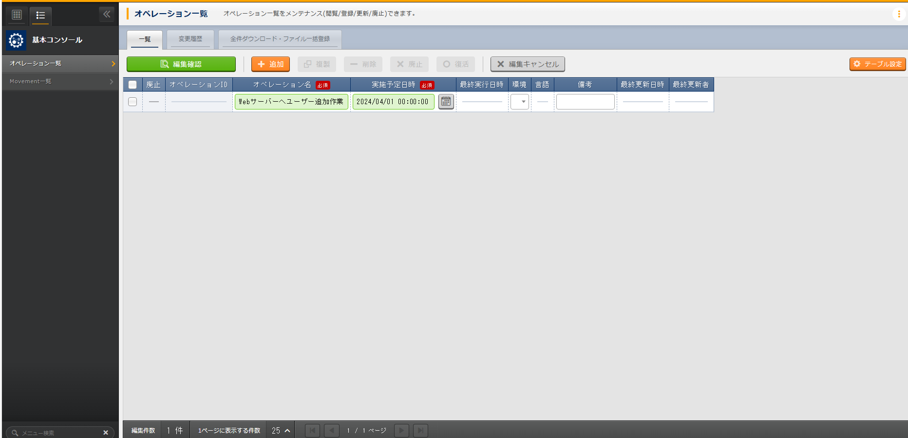

.. list-table:: オペレーション登録内容
   :widths: 15 10
   :header-rows: 1

   * - オペレーション名
     - 実施予定日時
   * - :kbd:`Webサーバーへユーザー追加作業`
     - :kbd:`2024/04/04 12:00:00`

パラメータ設計
==============

| 本演習ではユーザーの管理方法について扱いますが、ユーザーは何らかのグループに必ず所属する必要があります。
| まずは、ユーザーをパラメータシート上で管理できるようにしておきます。

グループのパラメータシート作成
------------------------------

| グループ用のパラメータシートを作成します。
| 利用する Ansible Playbook は下記のPlaybookになります、下記のパラメータが管理できるようにパラメータシートを作成しましょう。

.. code-block:: bash
   :caption: group.yml

   ---
   - name: create/update group
     group:
       name: "{{ item.0 }}"
       gid: "{{ item.1 }}"
     with_together:
       - "{{ group_name }}"
       - "{{ group_id }}"
       - "{{ group_action }}"
     when: item.2 == 'present'

   - name: create/update group
     group:
       name: "{{ item.0 }}"
       gid: "{{ item.1 }}"
     with_together:
       - "{{ group_name }}"
       - "{{ group_id }}"
       - "{{ group_action }}"
     when: item.2 == 'absent'

.. list-table:: グループ設定のパラメータ
   :widths: 10 15
   :header-rows: 1

   * - 項目
     - 説明
   * - group_name
     - グループ名
   * - group_id
     -	グループID
   * - action
     - | 構築時の設定
       | present: 作成/更新
       | absent: 削除

| :menuselection:`パラメータシート作成 --> パラメータシート定義・作成` から、パラメータシートを登録します。

.. tip:: 
   | :kbd:`必須` と :kbd:`一意制約` にチェックを入れることで、外部のパラメータシートから項目を参照できるようになります。

.. tip:: 
   | パラメータシート作成情報で :menuselection:`バンドル利用` を「利用する」にチェックを入れることで、1つの設定項目に対して複数のパラメータを設定することが可能になります。

.. figure:: ../../../../../images/learn/quickstart/Legacy_answer1/グループパラメータシート作成.png
   :width: 1200px
   :alt: グループのパラメータシート

.. list-table:: グループパラメータシートの設定値
   :widths: 10 10 10 10
   :header-rows: 1
   :class: filter-table

   * - 設定項目
     - 項目1設定値
     - 項目2設定値
     - 項目3設定値
   * - 項目の名前
     - :kbd:`グループ名`
     - :kbd:`グループID`
     - :kbd:`状態`
   * - 項目の名前(Rest API用) 
     - :kbd:`group_name`
     - :kbd:`group_id`
     - :kbd:`state`
   * - 入力方式
     - :kbd:`文字列(単一行)`
     - :kbd:`整数`
     - :kbd:`プルダウン選択`
   * - 最小値
     - (項目なし)
     - 1000
     - (項目なし)
   * - 最大値
     - (項目なし)
     - 
     - (項目なし)
   * - 最大バイト数
     - :kbd:`32`
     - (項目なし)
     - (項目なし)
   * - 正規表現
     - 
     - (項目なし)
     - (項目なし)
   * - 選択項目
     - (項目なし)
     - (項目なし)
     - :kbd:`入力用:状態:present-absent`
   * - 参照項目
     - (項目なし)
     - (項目なし)
     - 
   * - 初期値
     - 
     - 
     - 
   * - 必須
     - ✓
     - ✓
     - ✓
   * - 一意制約
     - ✓
     - ✓
     - 
   * - 説明
     - 
     - 
     - 
   * - 備考
     - 
     - 
     - 

.. list-table:: パラメータシート作成情報の設定値
   :widths: 5 10
   :header-rows: 1
   :class: filter-table

   * - 項目名
     - 設定値
   * - 項番
     - (自動入力)
   * - メニュー名
     - :kbd:`グループ`
   * - メニュー名(REST)
     - :kbd:`groups`
   * - 作成対象
     - :kbd:`パラメータシート（ホスト/オペレーションあり）`
   * - 表示順序
     - :kbd:`4`
   * - バンドル利用
     - 「利用する」にチェックを入れる(有効)
   * - 最終更新日時
     - (自動入力)
   * - 最終更新者
     - (自動入力)

ユーザーのパラメータシート作成
------------------------------

| ユーザー用のパラメータシートを作成します。
| 利用する Ansible Playbook は下記のPlaybookになります、下記のパラメータが管理できるようにパラメータシートを作成しましょう。

.. code-block:: bash
   :caption: user.yml

   ---
   - name: create user
     user:
       name: "{{ item.0 }}"
       uid: "{{ item.1 }}"
       group: "{{ item.2 }}"
       comment: "{{ item.3 }}"
       home: "{{ item.4 }}"
       shell: "{{ item.5 }}"
       password: "{{ item.6 | password_hash('sha512') }}"
     with_together:
       - "{{ user_name }}"
       - "{{ user_id }}"
       - "{{ group }}"
       - "{{ comment }}"
       - "{{ home_dir }}"
       - "{{ login_shell }}"
       - "{{ password }}"
       - "{{ user_action }}"
       - "{{ password_apply }}"
     when: item.7 == 'present' and password_apply

   - name: create user
     user:
       name: "{{ item.0 }}"
       uid: "{{ item.1 }}"
       group: "{{ item.2 }}"
       comment: "{{ item.3 }}"
       home: "{{ item.4 }}"
       shell: "{{ item.5 }}"
     with_together:
       - "{{ user_name }}"
       - "{{ user_id }}"
       - "{{ group }}"
       - "{{ comment }}"
       - "{{ home_dir }}"
       - "{{ login_shell }}"
       - "{{ user_action }}"
       - "{{ password_apply }}"
     when: item.6 == 'present' and not password_apply

   - name: delete user
     user:
       state: absent
       name: "{{ item.0 }}"
       remove: 'yes'
     with_together:
       - "{{ user_name }}"
       - "{{ user_action }}"
     when: item.1 == 'absent'

.. list-table:: ユーザー設定のパラメータ
   :widths: 10 15
   :header-rows: 1

   * - 項目
     - 説明
   * - user_name
     -	ユーザー名
   * - user_id
     -	ユーザーID
   * - group_id
     -	グループID
   * - comment
     -	コメント
   * - home_dir
     - ホームディレクトリ
   * - login_shell
     - ログインシェル名
   * - password
     -	パスワード
   * - action
     - | 構築時の設定
       | present: 作成/更新
       | absent: 削除
   * - password_apply
     - | 構築時のパスワード設定の有無
       | true: パスワードの設定を行う
       | false: パスワードの設定を行わない

| :menuselection:`パラメータシート作成 --> パラメータシート定義・作成` から、パラメータシートを登録します。

.. tip:: 
   | :menuselection:`入力方式` を :kbd:`プルダウン選択` に設定することで、:ref:`groups_parameter_sheet` で登録したデータシートを参照できるようになります。

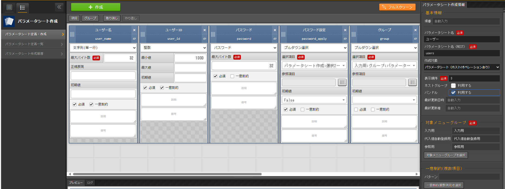

.. list-table:: パラメータ項目の設定値(1/2)
   :widths: 10 10 10 10 10 10
   :header-rows: 1
   :class: filter-table

   * - 設定項目
     - 項目1設定値
     - 項目2設定値
     - 項目3設定値
     - 項目4設定値
     - 項目5設定値
   * - 項目の名前
     - :kbd:`ユーザー名`
     - :kbd:`ユーザーID`
     - :kbd:`パスワード`
     - :kbd:`パスワード設定`
     - :kbd:`グループ`
   * - 項目の名前(Rest API用) 
     - :kbd:`user_name`
     - :kbd:`user_id`
     - :kbd:`password`
     - :kbd:`password_apply`
     - :kbd:`group`
   * - 入力方式
     - :kbd:`文字列(単一行)`
     - :kbd:`整数`
     - :kbd:`パスワード`
     - :kbd:`プルダウン選択`
     - :kbd:`プルダウン選択`
   * - 最大バイト数
     - :kbd:`32`
     - (項目なし)
     - :kbd:`32`
     - (項目なし)
     - (項目なし)
   * - 正規表現
     - 
     - (項目なし)
     - (項目なし)
     - (項目なし)
     - (項目なし)
   * - 最小値
     - (項目なし)
     - :kbd:`1000`
     - (項目なし)
     - (項目なし)
     - (項目なし)
   * - 最大値
     - (項目なし)
     - 
     - (項目なし)
     - (項目なし)
     - (項目なし)
   * - 選択項目
     - (項目なし)
     - (項目なし)
     - (項目なし)
     - :kbd:`パラメータシート作成:選択2:True-False`
     - :kbd:`入力用:グループ:グループ名`
   * - 参照項目
     - (項目なし)
     - (項目なし)
     - (項目なし)
     - 
     - 
   * - 初期値
     - 
     - 
     - (項目なし)
     - :kbd:`False`
     - 
   * - 必須
     - ✓
     - ✓
     - ✓
     - ✓
     - ✓
   * - 一意制約
     - ✓
     - ✓
     - 
     - 
     - 
   * - 説明
     - 
     - 
     - 
     - 
     - 
   * - 備考
     - 
     - 
     - 
     - 
     - 

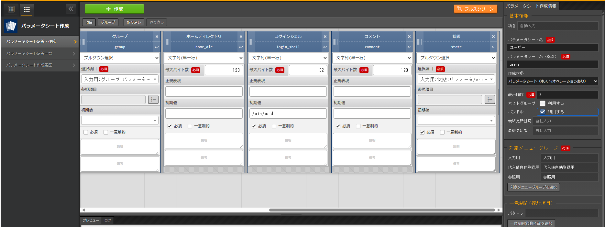

.. list-table:: パラメータ項目の設定値(2/2)
   :widths: 10 10 10 10 10
   :header-rows: 1
   :class: filter-table

   * - 設定項目
     - 項目6設定値
     - 項目7設定値
     - 項目8設定値
     - 項目9設定値
   * - 項目の名前
     - :kbd:`ホームディレクトリ`
     - :kbd:`ログインシェル`
     - :kbd:`コメント`
     - :kbd:`状態`
   * - 項目の名前(Rest API用) 
     - :kbd:`home_dir`
     - :kbd:`login_shell`
     - :kbd:`comment`
     - :kbd:`state`
   * - 入力方式
     - :kbd:`文字列(単一行)`
     - :kbd:`文字列(単一行)`
     - :kbd:`文字列(単一行)`
     - :kbd:`プルダウン選択`
   * - 最大バイト数
     - :kbd:`128`
     - :kbd:`32`
     - :kbd:`128`
     - (項目なし)
   * - 正規表現
     - 
     - 
     - 
     - (項目なし)
   * - 最小値
     - (項目なし)
     - (項目なし)
     - (項目なし)
     - (項目なし)
   * - 最大値
     - (項目なし)
     - (項目なし)
     - (項目なし)
     - (項目なし)
   * - 選択項目
     - (項目なし)
     - (項目なし)
     - (項目なし)
     - :kbd:`入力用:状態:present-absent`
   * - 参照項目
     - (項目なし)
     - (項目なし)
     - (項目なし)
     - 
   * - 初期値
     - 
     - :kbd:`/bin/bash`
     - 
     - 
   * - 必須
     - ✓
     - ✓
     - ✓
     - ✓
   * - 一意制約
     - 
     - 
     - 
     - 
   * - 説明
     - 
     - 
     - 
     - 
   * - 備考
     - 
     - 
     - 
     - 

.. list-table:: パラメータシート作成情報の設定値
   :widths: 5 10
   :header-rows: 1
   :class: filter-table

   * - 項目名
     - 設定値
   * - 項番
     - (自動入力)
   * - メニュー名
     - :kbd:`ユーザー`
   * - メニュー名(REST)
     - :kbd:`users`
   * - 作成対象
     - :kbd:`パラメータシート（ホスト/オペレーションあり）`
   * - 表示順序
     - :kbd:`3`
   * - バンドル利用
     - 「利用する」にチェックを入れる(有効)
   * - 最終更新日時
     - (自動入力)
   * - 最終更新者
     - (自動入力)

作業対象の登録
==============

| 作業実施を行う対象機器の登録を行います。

機器登録
--------

| 作業対象となるサーバーは :doc:`前のシナリオ <Legacy_scenario1>` で登録した web01 を利用するため、作業は不要です。

作業手順の登録
==============

| グループを作成・削除してから、ユーザーを作成・削除する順番で Ansible Playbook が実行されるように Movement を設定します。
| これまでのシナリオでは、1つの Movement ごとに1つの Ansible Playbook を紐付けていましたが、今回は 1つの Movement に対して、グループ管理とユーザー管理が行えるように設定します。

.. note:: 
   | グループ管理とユーザー管理それぞれに対して、Movement を1つずつ作成しても同じように動作させることができます。

Movement 登録
-------------

| :menuselection:`Ansible-Legacy --> Movement一覧` から、ユーザー管理のための Movement を登録します。

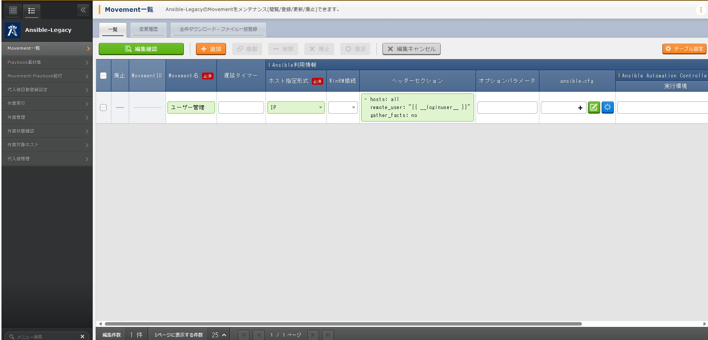
   
.. list-table:: Movement 情報の設定値
   :widths: 10 10
   :header-rows: 2

   * - Movement名
     - Ansible利用情報
   * - 
     - ホスト指定形式
   * - :kbd:`ユーザー管理`
     - :kbd:`IP`

Ansible Playbook 登録
---------------------

| 本シナリオでは、 以下のPlaybookを利用します。以下をコピーして、yml形式でgroup.ymlとuser.ymlを作成してください。

.. code-block:: bash
   :caption: group.yml

   ---
   - name: create/update group
     group:
       name: "{{ item.0 }}"
       gid: "{{ item.1 }}"
     with_together:
       - "{{ group_name }}"
       - "{{ group_id }}"
       - "{{ group_action }}"
     when: item.2 == 'present'

   - name: create/update group
     group:
       name: "{{ item.0 }}"
       gid: "{{ item.1 }}"
     with_together:
       - "{{ group_name }}"
       - "{{ group_id }}"
       - "{{ group_action }}"
     when: item.2 == 'absent'

.. code-block:: bash
   :caption: user.yml

   ---
   - name: create user
     user:
       name: "{{ item.0 }}"
       uid: "{{ item.1 }}"
       group: "{{ item.2 }}"
       comment: "{{ item.3 }}"
       home: "{{ item.4 }}"
       shell: "{{ item.5 }}"
       password: "{{ item.6 | password_hash('sha512') }}"
     with_together:
       - "{{ user_name }}"
       - "{{ user_id }}"
       - "{{ group }}"
       - "{{ comment }}"
       - "{{ home_dir }}"
       - "{{ login_shell }}"
       - "{{ password }}"
       - "{{ user_action }}"
       - "{{ password_apply }}"
     when: item.7 == 'present' and password_apply

   - name: create user
     user:
       name: "{{ item.0 }}"
       uid: "{{ item.1 }}"
       group: "{{ item.2 }}"
       comment: "{{ item.3 }}"
       home: "{{ item.4 }}"
       shell: "{{ item.5 }}"
     with_together:
       - "{{ user_name }}"
       - "{{ user_id }}"
       - "{{ group }}"
       - "{{ comment }}"
       - "{{ home_dir }}"
       - "{{ login_shell }}"
       - "{{ user_action }}"
       - "{{ password_apply }}"
     when: item.6 == 'present' and not password_apply

   - name: delete user
     user:
       state: absent
       name: "{{ item.0 }}"
       remove: 'yes'
     with_together:
       - "{{ user_name }}"
       - "{{ user_action }}"
     when: item.1 == 'absent'

| :menuselection:`Ansible-Legacy --> Playbook素材集` から、上記のPlaybookを登録します。

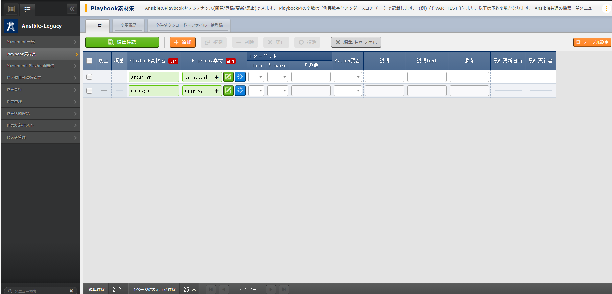

.. list-table:: Ansible Playbook 情報の登録
  :widths: 10 20
  :header-rows: 1

  * - Playbook素材名
    - Playbook素材
  * - :kbd:`group`
    - :file:`group.yml`
  * - :kbd:`user`
    - :file:`user.yml`

Movement と Ansible Playbook の紐付け
-------------------------------------

| :menuselection:`Ansible-Legacy --> Movement-Playbook紐付` から、Movement と Ansible Playbook の紐付けを行います。
| 本シナリオでは、 group.yml および user.ymlを利用します。
| ユーザーを作成する際には、先にグループを指定する必要があるため下記の順序でインクルードする必要があります。

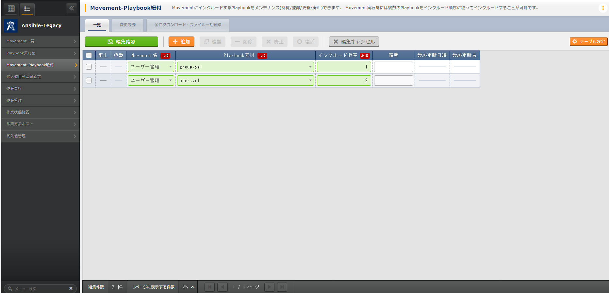

.. list-table:: Movement-Playbook紐付け情報の登録
  :widths: 10 10 10
  :header-rows: 1

  * - Movement名
    - Playbook素材
    - インクルード順序
  * - :kbd:`ユーザー管理`
    - :kbd:`group.yml`
    - :kbd:`1`
  * - :kbd:`ユーザー管理`
    - :kbd:`user.yml`
    - :kbd:`2`

代入値自動登録設定
------------------

| :menuselection:`Ansible-Legacy --> 代入値自動登録設定` から、パラメータシートの項目と Ansible Playbook の変数の紐付けを行います。
| 大量のデータを一度に登録するような場合には、全件ダウンロード・ファイル一括登録を使って、ファイルからデータを投入する方法が適切です。

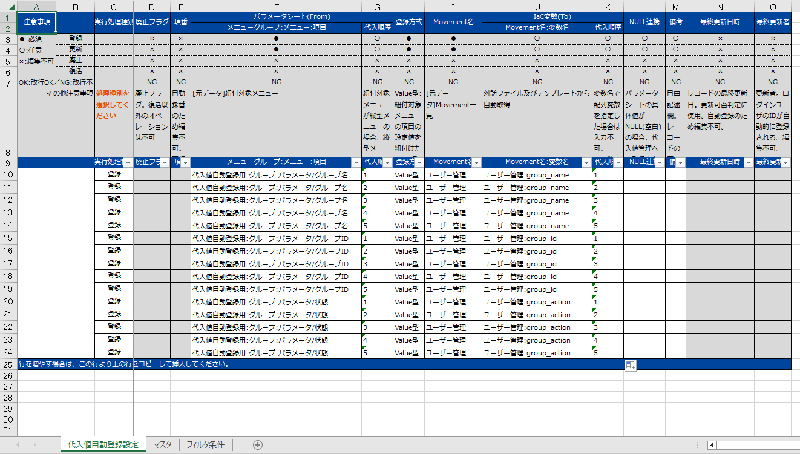

.. list-table:: グループの代入値自動登録設定の設定値
  :widths: 40 10 10 20 20 10
  :header-rows: 2

  * - パラメータシート(From)
    -
    - 登録方式
    - Movement名
    - IaC変数(To)
    -
  * - メニューグループ:メニュー:項目
    - 代入順序
    -
    -
    - Movement名:変数名
    - 代入順序
  * - :kbd:`代入値自動登録用:グループ:グループ名`
    - :kbd:`1`
    - :kbd:`Value型`
    - :kbd:`ユーザー管理`
    - :kbd:`ユーザー管理:group_name`
    - :kbd:`1`
  * - :kbd:`代入値自動登録用:グループ:グループID`
    - :kbd:`1`
    - :kbd:`Value型`
    - :kbd:`ユーザー管理`
    - :kbd:`ユーザー管理:group_id`
    - :kbd:`1`
  * - :kbd:`代入値自動登録用:グループ:状態`
    - :kbd:`1`
    - :kbd:`Value型`
    - :kbd:`ユーザー管理`
    - :kbd:`ユーザー管理:group_action`
    - :kbd:`1`
  * - :kbd:`代入値自動登録用:グループ:グループ名`
    - :kbd:`2`
    - :kbd:`Value型`
    - :kbd:`ユーザー管理`
    - :kbd:`ユーザー管理:group_name`
    - :kbd:`2`
  * - :kbd:`代入値自動登録用:グループ:グループID`
    - :kbd:`2`
    - :kbd:`Value型`
    - :kbd:`ユーザー管理`
    - :kbd:`ユーザー管理:group_id`
    - :kbd:`2`
  * - :kbd:`代入値自動登録用:グループ:状態`
    - :kbd:`2`
    - :kbd:`Value型`
    - :kbd:`ユーザー管理`
    - :kbd:`ユーザー管理:group_action`
    - :kbd:`2`
  * - :kbd:`...`
    - :kbd:`...`
    - :kbd:`...`
    - :kbd:`...`
    - :kbd:`...`
    - :kbd:`...`
  * - :kbd:`代入値自動登録用:グループ:グループ名`
    - :kbd:`5`
    - :kbd:`Value型`
    - :kbd:`ユーザー管理`
    - :kbd:`ユーザー管理:group_name`
    - :kbd:`5`
  * - :kbd:`代入値自動登録用:グループ:グループID`
    - :kbd:`5`
    - :kbd:`Value型`
    - :kbd:`ユーザー管理`
    - :kbd:`ユーザー管理:group_id`
    - :kbd:`5`
  * - :kbd:`代入値自動登録用:グループ:状態`
    - :kbd:`5`
    - :kbd:`Value型`
    - :kbd:`ユーザー管理`
    - :kbd:`ユーザー管理:group_action`
    - :kbd:`5`

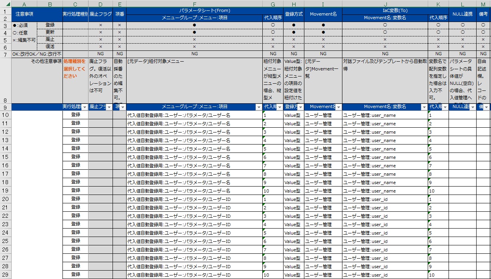

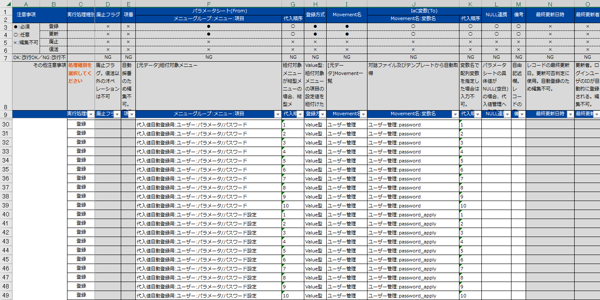

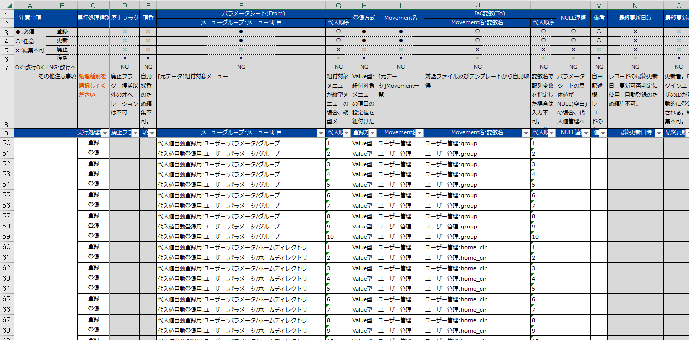

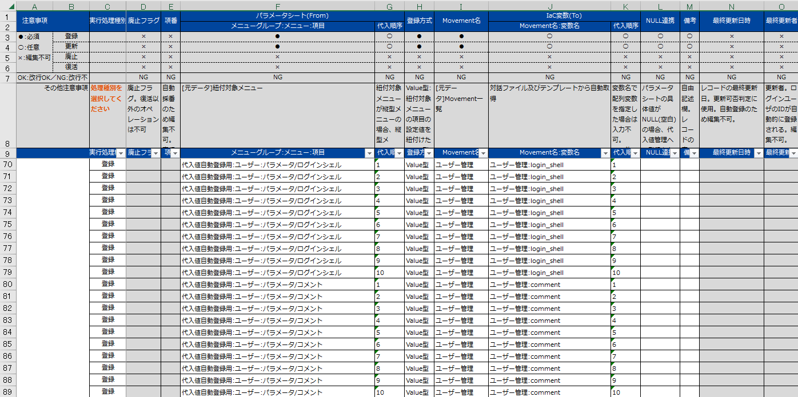

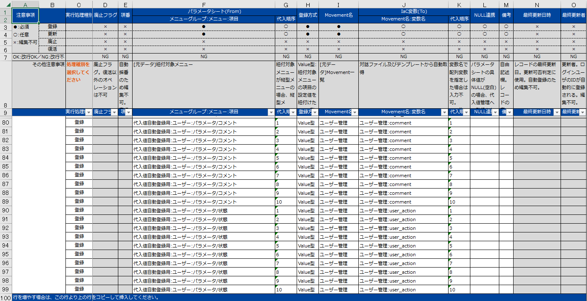

.. list-table:: ユーザーの代入値自動登録設定の設定値
  :widths: 40 10 10 20 20 10
  :header-rows: 2

  * - パラメータシート(From)
    -
    - 登録方式
    - Movement名
    - IaC変数(To)
    -
  * - メニューグループ:メニュー:項目
    - 代入順序
    -
    -
    - Movement名:変数名
    - 代入順序
  * - :kbd:`代入値自動登録用:ユーザー:ユーザー名`
    - :kbd:`1`
    - :kbd:`Value型`
    - :kbd:`ユーザー管理`
    - :kbd:`ユーザー管理:user_name`
    - :kbd:`1`
  * - :kbd:`代入値自動登録用:ユーザー:ユーザーID`
    - :kbd:`1`
    - :kbd:`Value型`
    - :kbd:`ユーザー管理`
    - :kbd:`ユーザー管理:user_id`
    - :kbd:`1`
  * - :kbd:`代入値自動登録用:ユーザー:パスワード`
    - :kbd:`1`
    - :kbd:`Value型`
    - :kbd:`ユーザー管理`
    - :kbd:`ユーザー管理:password`
    - :kbd:`1`
  * - :kbd:`代入値自動登録用:ユーザー:パスワード設定`
    - :kbd:`1`
    - :kbd:`Value型`
    - :kbd:`ユーザー管理`
    - :kbd:`ユーザー管理:password_apply`
    - :kbd:`1`
  * - :kbd:`代入値自動登録用:ユーザー:グループ`
    - :kbd:`1`
    - :kbd:`Value型`
    - :kbd:`ユーザー管理`
    - :kbd:`ユーザー管理:group`
    - :kbd:`1`
  * - :kbd:`代入値自動登録用:ユーザー:ホームディレクトリ`
    - :kbd:`1`
    - :kbd:`Value型`
    - :kbd:`ユーザー管理`
    - :kbd:`ユーザー管理:home_dir`
    - :kbd:`1`
  * - :kbd:`代入値自動登録用:ユーザー:ログインシェル`
    - :kbd:`1`
    - :kbd:`Value型`
    - :kbd:`ユーザー管理`
    - :kbd:`ユーザー管理:login_shell`
    - :kbd:`1`
  * - :kbd:`代入値自動登録用:ユーザー:コメント`
    - :kbd:`1`
    - :kbd:`Value型`
    - :kbd:`ユーザー管理`
    - :kbd:`ユーザー管理:comment`
    - :kbd:`1`
  * - :kbd:`代入値自動登録用:ユーザー:状態`
    - :kbd:`1`
    - :kbd:`Value型`
    - :kbd:`ユーザー管理`
    - :kbd:`ユーザー管理:user_action`
    - :kbd:`1`
  * - :kbd:`代入値自動登録用:ユーザー:ユーザー名`
    - :kbd:`2`
    - :kbd:`Value型`
    - :kbd:`ユーザー管理`
    - :kbd:`ユーザー管理:user_name`
    - :kbd:`2`
  * - :kbd:`代入値自動登録用:ユーザー:ユーザーID`
    - :kbd:`2`
    - :kbd:`Value型`
    - :kbd:`ユーザー管理`
    - :kbd:`ユーザー管理:user_id`
    - :kbd:`2`
  * - :kbd:`代入値自動登録用:ユーザー:パスワード`
    - :kbd:`2`
    - :kbd:`Value型`
    - :kbd:`ユーザー管理`
    - :kbd:`ユーザー管理:password`
    - :kbd:`2`
  * - :kbd:`代入値自動登録用:ユーザー:パスワード設定`
    - :kbd:`2`
    - :kbd:`Value型`
    - :kbd:`ユーザー管理`
    - :kbd:`ユーザー管理:password_apply`
    - :kbd:`2`
  * - :kbd:`代入値自動登録用:ユーザー:グループ`
    - :kbd:`2`
    - :kbd:`Value型`
    - :kbd:`ユーザー管理`
    - :kbd:`ユーザー管理:group`
    - :kbd:`2`
  * - :kbd:`代入値自動登録用:ユーザー:ホームディレクトリ`
    - :kbd:`2`
    - :kbd:`Value型`
    - :kbd:`ユーザー管理`
    - :kbd:`ユーザー管理:home_dir`
    - :kbd:`2`
  * - :kbd:`代入値自動登録用:ユーザー:ログインシェル`
    - :kbd:`2`
    - :kbd:`Value型`
    - :kbd:`ユーザー管理`
    - :kbd:`ユーザー管理:login_shell`
    - :kbd:`2`
  * - :kbd:`代入値自動登録用:ユーザー:コメント`
    - :kbd:`2`
    - :kbd:`Value型`
    - :kbd:`ユーザー管理`
    - :kbd:`ユーザー管理:comment`
    - :kbd:`2`
  * - :kbd:`代入値自動登録用:ユーザー:状態`
    - :kbd:`2`
    - :kbd:`Value型`
    - :kbd:`ユーザー管理`
    - :kbd:`ユーザー管理:user_action`
    - :kbd:`2`
  * - :kbd:`代入値自動登録用:ユーザー:ユーザー名`
    - :kbd:`3`
    - :kbd:`Value型`
    - :kbd:`ユーザー管理`
    - :kbd:`ユーザー管理:user_name`
    - :kbd:`3`
  * - :kbd:`代入値自動登録用:ユーザー:ユーザーID`
    - :kbd:`3`
    - :kbd:`Value型`
    - :kbd:`ユーザー管理`
    - :kbd:`ユーザー管理:user_id`
    - :kbd:`3`
  * - :kbd:`代入値自動登録用:ユーザー:パスワード`
    - :kbd:`3`
    - :kbd:`Value型`
    - :kbd:`ユーザー管理`
    - :kbd:`ユーザー管理:password`
    - :kbd:`3`
  * - :kbd:`代入値自動登録用:ユーザー:パスワード設定`
    - :kbd:`3`
    - :kbd:`Value型`
    - :kbd:`ユーザー管理`
    - :kbd:`ユーザー管理:password_apply`
    - :kbd:`3`
  * - :kbd:`代入値自動登録用:ユーザー:グループ`
    - :kbd:`3`
    - :kbd:`Value型`
    - :kbd:`ユーザー管理`
    - :kbd:`ユーザー管理:group`
    - :kbd:`3`
  * - :kbd:`代入値自動登録用:ユーザー:ホームディレクトリ`
    - :kbd:`3`
    - :kbd:`Value型`
    - :kbd:`ユーザー管理`
    - :kbd:`ユーザー管理:home_dir`
    - :kbd:`3`
  * - :kbd:`代入値自動登録用:ユーザー:ログインシェル`
    - :kbd:`3`
    - :kbd:`Value型`
    - :kbd:`ユーザー管理`
    - :kbd:`ユーザー管理:login_shell`
    - :kbd:`3`
  * - :kbd:`代入値自動登録用:ユーザー:コメント`
    - :kbd:`3`
    - :kbd:`Value型`
    - :kbd:`ユーザー管理`
    - :kbd:`ユーザー管理:comment`
    - :kbd:`3`
  * - :kbd:`代入値自動登録用:ユーザー:状態`
    - :kbd:`3`
    - :kbd:`Value型`
    - :kbd:`ユーザー管理`
    - :kbd:`ユーザー管理:user_action`
    - :kbd:`3`
  * - :kbd:`代入値自動登録用:ユーザー:ユーザー名`
    - :kbd:`4`
    - :kbd:`Value型`
    - :kbd:`ユーザー管理`
    - :kbd:`ユーザー管理:user_name`
    - :kbd:`4`
  * - :kbd:`代入値自動登録用:ユーザー:ユーザーID`
    - :kbd:`4`
    - :kbd:`Value型`
    - :kbd:`ユーザー管理`
    - :kbd:`ユーザー管理:user_id`
    - :kbd:`4`
  * - :kbd:`代入値自動登録用:ユーザー:パスワード`
    - :kbd:`4`
    - :kbd:`Value型`
    - :kbd:`ユーザー管理`
    - :kbd:`ユーザー管理:password`
    - :kbd:`4`
  * - :kbd:`代入値自動登録用:ユーザー:パスワード設定`
    - :kbd:`4`
    - :kbd:`Value型`
    - :kbd:`ユーザー管理`
    - :kbd:`ユーザー管理:password_apply`
    - :kbd:`4`
  * - :kbd:`代入値自動登録用:ユーザー:グループ`
    - :kbd:`4`
    - :kbd:`Value型`
    - :kbd:`ユーザー管理`
    - :kbd:`ユーザー管理:group`
    - :kbd:`4`
  * - :kbd:`代入値自動登録用:ユーザー:ホームディレクトリ`
    - :kbd:`4`
    - :kbd:`Value型`
    - :kbd:`ユーザー管理`
    - :kbd:`ユーザー管理:home_dir`
    - :kbd:`4`
  * - :kbd:`代入値自動登録用:ユーザー:ログインシェル`
    - :kbd:`4`
    - :kbd:`Value型`
    - :kbd:`ユーザー管理`
    - :kbd:`ユーザー管理:login_shell`
    - :kbd:`4`
  * - :kbd:`代入値自動登録用:ユーザー:コメント`
    - :kbd:`4`
    - :kbd:`Value型`
    - :kbd:`ユーザー管理`
    - :kbd:`ユーザー管理:comment`
    - :kbd:`4`
  * - :kbd:`代入値自動登録用:ユーザー:状態`
    - :kbd:`4`
    - :kbd:`Value型`
    - :kbd:`ユーザー管理`
    - :kbd:`ユーザー管理:user_action`
    - :kbd:`4`
  * - :kbd:`...`
    - :kbd:`...`
    - :kbd:`...`
    - :kbd:`...`
    - :kbd:`...`
    - :kbd:`...`
  * - :kbd:`代入値自動登録用:ユーザー:ユーザー名`
    - :kbd:`10`
    - :kbd:`Value型`
    - :kbd:`ユーザー管理`
    - :kbd:`ユーザー管理:user_name`
    - :kbd:`10`
  * - :kbd:`代入値自動登録用:ユーザー:ユーザーID`
    - :kbd:`10`
    - :kbd:`Value型`
    - :kbd:`ユーザー管理`
    - :kbd:`ユーザー管理:user_id`
    - :kbd:`10`
  * - :kbd:`代入値自動登録用:ユーザー:パスワード`
    - :kbd:`10`
    - :kbd:`Value型`
    - :kbd:`ユーザー管理`
    - :kbd:`ユーザー管理:password`
    - :kbd:`10`
  * - :kbd:`代入値自動登録用:ユーザー:パスワード設定`
    - :kbd:`10`
    - :kbd:`Value型`
    - :kbd:`ユーザー管理`
    - :kbd:`ユーザー管理:password_apply`
    - :kbd:`10`
  * - :kbd:`代入値自動登録用:ユーザー:グループ`
    - :kbd:`10`
    - :kbd:`Value型`
    - :kbd:`ユーザー管理`
    - :kbd:`ユーザー管理:group`
    - :kbd:`10`
  * - :kbd:`代入値自動登録用:ユーザー:ホームディレクトリ`
    - :kbd:`10`
    - :kbd:`Value型`
    - :kbd:`ユーザー管理`
    - :kbd:`ユーザー管理:home_dir`
    - :kbd:`10`
  * - :kbd:`代入値自動登録用:ユーザー:ログインシェル`
    - :kbd:`10`
    - :kbd:`Value型`
    - :kbd:`ユーザー管理`
    - :kbd:`ユーザー管理:login_shell`
    - :kbd:`10`
  * - :kbd:`代入値自動登録用:ユーザー:コメント`
    - :kbd:`10`
    - :kbd:`Value型`
    - :kbd:`ユーザー管理`
    - :kbd:`ユーザー管理:comment`
    - :kbd:`10`
  * - :kbd:`代入値自動登録用:ユーザー:状態`
    - :kbd:`10`
    - :kbd:`Value型`
    - :kbd:`ユーザー管理`
    - :kbd:`ユーザー管理:user_action`
    - :kbd:`10`

ユーザー追加作業の実施
======================

| Movement を実行してユーザーとグループを追加します。

パラメータ設定
--------------

| :menuselection:`入力用 --> グループ` から、グループに対するパラメータを登録します。

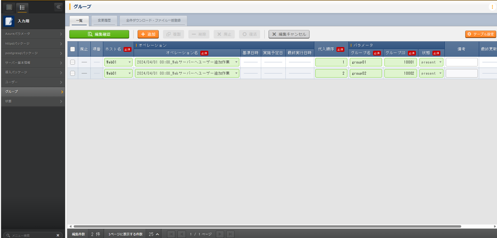

.. list-table:: グループパラメータの設定値
  :widths: 5 20 5 5 5 5
  :header-rows: 2

  * - ホスト名
    - オペレーション
    - 代入順序
    - パラメータ
    - 
    - 
  * - 
    - オペレーション名
    - 
    - グループ名
    - グループID
    - 状態
  * - web01
    - :kbd:`2023/04/04 12:00:00_Webサーバーへユーザー追加作業`
    - :kbd:`1`
    - :kbd:`www`
    - :kbd:`10001`
    - :kbd:`present`
  * - web01
    - :kbd:`2023/04/04 12:00:00_Webサーバーへユーザー追加作業`
    - :kbd:`2`
    - :kbd:`app`
    - :kbd:`10002`
    - :kbd:`present`

| :menuselection:`入力用 --> ユーザー` から、ユーザーに対するパラメータを登録します。

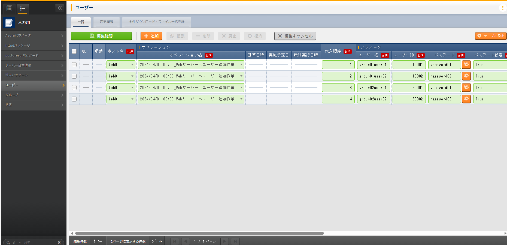

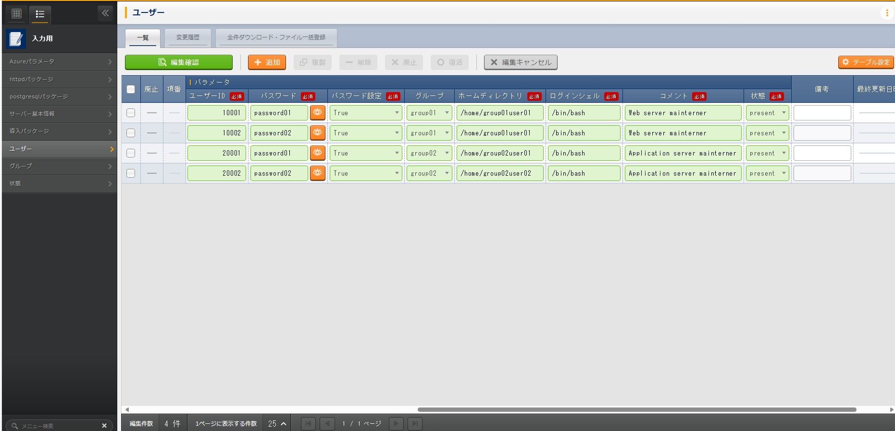

.. list-table:: ユーザーパラメータの設定値
  :widths: 5 20 5 5 5 5 5 5 10 5 10 5
  :header-rows: 2

  * - ホスト名
    - オペレーション
    - 代入順序
    - パラメータ
    - 
    - 
    - 
    - 
    - 
    - 
    - 
    - 
  * - 
    - オペレーション名
    - 
    - ユーザー名
    - ユーザーID
    - パスワード
    - パスワード設定
    - グループ
    - ホームディレクトリ
    - ログインシェル
    - コメント
    - 状態
  * - web01
    - :kbd:`2024/04/04 12:00:00_Webサーバーへユーザー追加作業`
    - :kbd:`1`
    - :kbd:`wwwuser01`
    - :kbd:`10001`
    - :kbd:`password01`
    - :kbd:`True`
    - :kbd:`www`
    - :kbd:`/home/wwwuser01`
    - :kbd:`/bin/bash`
    - :kbd:`Web server mainterner`
    - :kbd:`present`
  * - web01
    - :kbd:`2024/04/04 12:00:00_Webサーバーへユーザー追加作業`
    - :kbd:`2`
    - :kbd:`wwwuser02`
    - :kbd:`10002`
    - :kbd:`password02`
    - :kbd:`True`
    - :kbd:`www`
    - :kbd:`/home/wwwuser02`
    - :kbd:`/bin/bash`
    - :kbd:`Web server mainterner`
    - :kbd:`present`
  * - web01
    - :kbd:`2024/04/04 12:00:00_Webサーバーへユーザー追加作業`
    - :kbd:`3`
    - :kbd:`appuser01`
    - :kbd:`20001`
    - :kbd:`password01`
    - :kbd:`True`
    - :kbd:`app`
    - :kbd:`/home/appuser01`
    - :kbd:`/bin/bash`
    - :kbd:`Application server mainterner`
    - :kbd:`present`
  * - web01
    - :kbd:`2024/04/04 12:00:00_Webサーバーへユーザー追加作業`
    - :kbd:`4`
    - :kbd:`appuser02`
    - :kbd:`20002`
    - :kbd:`password02`
    - :kbd:`True`
    - :kbd:`app`
    - :kbd:`/home/appuser02`
    - :kbd:`/bin/bash`
    - :kbd:`Application server mainterner`
    - :kbd:`present`

作業実行
--------

1. 事前確認

   | 現在のサーバーの状態を確認しましょう。

   | グループ一覧を確認します。

   .. code-block:: bash
      :caption: コマンド

      # グループ一覧の取得
      cat /etc/groups|grep -E "www|app"

   .. code-block:: bash
      :caption: 実行結果

      # 何も表示されない

   | ユーザー一覧を確認します。

   .. code-block:: bash
      :caption: コマンド

      # ユーザー一覧の取得
      cat /etc/passwd|grep -E "www|app"

   .. code-block:: bash
      :caption: 実行結果

      # 何も表示されない

2. 作業実行

   | :menuselection:`Ansible-Legacy --> 作業実行` から、:kbd:`ユーザー管理` Movement を選択し、:guilabel:` 作業実行` を押下します。
   | 次に、:menuselection:`作業実行設定` で、オペレーションに :kbd:`Webサーバーへユーザー追加作業` を選択し、:guilabel:`作業実行` を押下します。

   | :menuselection:`作業状態確認` 画面が開き、実行が完了した後に、ステータスが「完了」になったことを確認します。

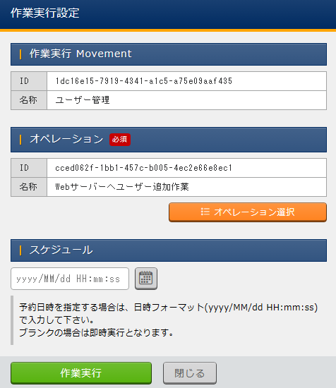

1. 事後確認

   | 再度サーバーに下記のグループとユーザーが設定されていることを確認しましょう。

   | グループ一覧を確認します。

   .. code-block:: bash
      :caption: コマンド

      # グループ一覧の取得
      cat /etc/group|grep -E "app|www"

   .. code-block:: bash
      :caption: 実行結果

      www:x:10001:
      app:x:10002:

   | ユーザー一覧を確認します。

   .. code-block:: bash
      :caption: コマンド

      # ユーザー一覧の取得
      cat /etc/passwd|grep -E "app|www"

   .. code-block:: bash
      :caption: 実行結果

      wwwuser01:x:10001:10001:Web server mainterner:/home/wwwuser01:/bin/bash
      wwwuser02:x:10002:10001:Web server mainterner:/home/wwwuser02:/bin/bash
      appuser01:x:20001:10002:Application server mainterner:/home/appuser01:/bin/bash
      appuser02:x:20002:10002:Application server mainterner:/home/appuser02:/bin/bash

(参考) 既存のジョブフローへの追加
=================================

| 本演習では、ジョブフローを利用せずに Movement から直接ユーザー設定作業を実施しましたが、当然ジョブフローの利用も可能です。
| シナリオ3までに行ったサーバー構築の一連の作業の中に本演習で作成した Movement を組み込むことで、ホスト名登録、パッケージ導入、ユーザー登録といった一連の作業フローを組み立てることができます。
| この場合の作業の流れは、

1. ジョブフローの作成
2. オペレーション登録
3. ホスト名のパラメータ登録 (パラメータ変更なし)
4. パッケージのパラメータ登録 (パラメータ変更なし)
5. グループのパラメータ登録
6. ユーザーのパラメータ登録
7. ジョブフロー実行

| となります。
| しかし、Exastro IT Automation では、オペレーションと機器の組み合わせごとにパラメータを登録する必要があるため、今回のように、グループとユーザーのみの設定にも関わらず、それ以外のホスト名やパッケージといったパラメータを設定をしなげればなりません。

| このようなパラメータの設定個別オペレーションを使うことで、Movement ごとにオペレーションを設定することができます。
| ただし、個別オペレーションを使った場合、実行時のオペレーションとは異なるオペレーションによりパラメータが管理されるため、運用上パラメータの見通しが悪くなることもあります。

ジョブフローの編集と実行 (失敗例)
---------------------------------

| :menuselection:`Conductor --> Conductor一覧` から、:kbd:`サーバー構築` の :guilabel:`詳細` を押下し、ジョブフローを編集します。

| 1. 画面上部の :guilabel:` 編集` を押下し、更新モードに移行します。
| 2. 右下のペインに、作成した :kbd:`ユーザー管理` Movement があるので、これを画面中央にドラッグアンドドロップします。
| 3. 各 Mode 間を下記の様に再接続します。
 
.. list-table:: オブジェクト間の接続
   :widths: 10 10
   :header-rows: 1

   * - OUT
     - IN
   * - :kbd:`Start`
     - :kbd:`ホスト名設定`
   * - :kbd:`ホスト名設定`
     - :kbd:`パッケージ管理`
   * - :kbd:`パッケージ管理`
     - :kbd:`ユーザー管理`
   * - :kbd:`ユーザー管理`
     - :kbd:`End`

| 4. 画面上部にある、 :guilabel:` 更新` を押下します。
| 5. :menuselection:`Conductor --> Conductor編集/作業実行` から、:guilabel:` 選択` を押下します。
| 6. :kbd:`サーバー構築` Conductor を選択し、:guilabel:`選択決定` を押下します。
| 7. オペレーションに :kbd:`Webサーバーへユーザー追加作業` を選択し、:guilabel:`作業実行` を押下します。

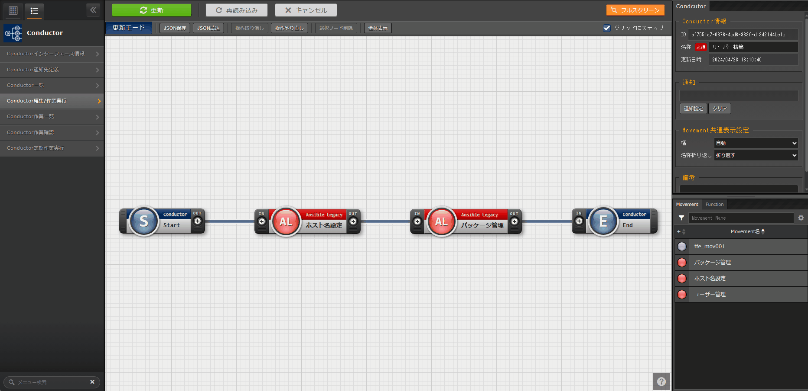

| :menuselection:`Conductor作業確認` 画面が開き、ホスト名設定の Movement が ERROR となり想定外エラーになるはずです。
| これは、:kbd:`Webサーバーへユーザー追加作業` に紐づくホスト名のパラメータがないことにより起こる動作です。

ジョブフローの編集と実行 (成功例)
---------------------------------

| :menuselection:`Conductor --> Conductor一覧` から、:kbd:`サーバー構築` の :guilabel:`詳細` を押下し、再度ジョブフローを編集します。

| 1. 画面上部の :guilabel:` 編集` を押下し、更新モードに移行します。
| 2. 右下のペインに、作成した :kbd:`ユーザー管理` Movement があるので、これを画面中央にドラッグアンドドロップします。
| 3. 各 Mode に対して下記の様に個別オペレーションを設定します。
 
.. list-table:: 個別オペレーション設定
   :widths: 10 10
   :header-rows: 1

   * - Movement
     - オペレーション名
   * - :kbd:`ホスト名設定`
     - :kbd:`RHEL8のホスト名変更作業`
   * - :kbd:`パッケージ管理`
     - :kbd:`RHEL8のパッケージ管理`
   * - :kbd:`ユーザー管理`
     - :kbd:`Webサーバーへユーザー追加作業`

| 4. 画面上部にある、 :guilabel:` 更新` を押下します。
| 5. :menuselection:`Conductor --> Conductor編集/作業実行` から、:guilabel:` 選択` を押下します。
| 6. :kbd:`サーバー構築` Conductor を選択し、:guilabel:`選択決定` を押下します。
| 7. オペレーションに :kbd:`Webサーバーへユーザー追加作業` を選択し、:guilabel:`作業実行` を押下します。

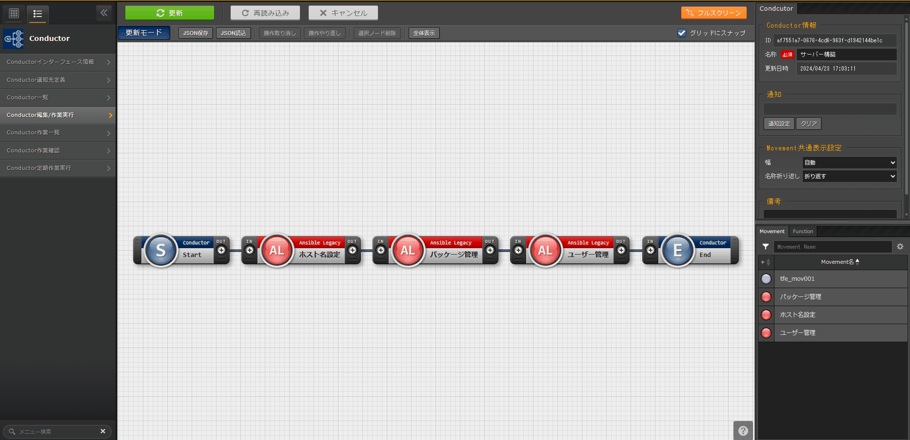

| :menuselection:`Conductor作業確認` 画面が開き、実行が完了した後に、全ての Movement のステータスが「Done」になったことを確認します。

まとめ
======

| 本シナリオでは、これまでのシナリオの確認のために、演習課題を実施しました。
| また Conductor のパラメータ連携の1つの手段として、個別オペレーションについて紹介をしました。
| より詳細な情報を知りたい場合は、:doc:`../../../manuals/index` を参照してください。